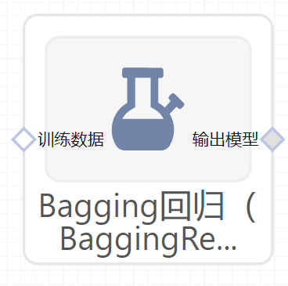

# Bagging回归（BaggingRegressor）使用文档
| 组件名称 |Bagging回归（BaggingRegressor）|  |  |
| --- | --- | --- | --- |
| 工具集 | 机器学习 |  |  |
| 组件作者 | 雪浪云-墨文 |  |  |
| 文档版本 | 1.0 |  |  |
| 功能 | Bagging回归（BaggingRegressor）算法|  |  |
| 镜像名称 | ml_components:3 |  |  |
| 开发语言 | Python |  |  |

## 组件原理
Bagging的弱学习器之间没有Boosting那样的联系。它的特点在“随机采样”。

随机采样(bootsrap)就是从我们的训练集里面采集固定个数的样本，但是每采集一个样本后，都将样本放回。也就是说，之前采集到的样本在放回后有可能继续被采集到。

注意到这和GBDT的子采样是不同的。GBDT的子采样是无放回采样，而Bagging的子采样是有放回采样。

Bagging对于弱学习器没有限制，这和Adaboost一样。但是最常用的一般也是决策树和神经网络。

Bagging的集合策略也比较简单。对于分类问题，通常使用简单投票法，得到最多票数的类别或者类别之一为最终的模型输出。对于回归问题，通常使用简单平均法，对T个弱学习器得到的回归结果进行算术平均得到最终的模型输出。

由于Bagging算法每次都进行采样来训练模型，因此泛化能力很强，对于降低模型的方差很有作用。当然对于训练集的拟合程度就会差一些，也就是模型的偏倚会大一些。

## 输入桩
支持单个csv文件输入。
### 输入端子1

- **端口名称**：训练数据
- **输入类型**：Csv文件
- **功能描述**： 输入用于训练的数据
## 输出桩
支持sklearn模型输出。
### 输出端子1

- **端口名称**：输出模型
- **输出类型**：sklearn模型
- **功能描述**： 输出训练好的模型用于预测
## 参数配置
### n_estimators

- **功能描述**：集合中的base模型数。
- **必选参数**：是
- **默认值**：10
### max_samples 

- **功能描述**：要从X中抽取样本数来训练每个base模型。如果为整数，则抽取max_samples 个样本。如果为浮点数，则抽取max_samples * X.shape[0] 个样本。
- **必选参数**：是
- **默认值**：1.0
### max_features

- **功能描述**：要从X中抽取样本数来训练每个base模型。如果为整数，则抽取max_features 个特征。如果为浮点数，则抽取max_features * X.shape[1] 个特征。
- **必选参数**：是
- **默认值**：1.0
### bootstrap

- **功能描述**：样品是否用有放回的抽取。如果为假，则执行不放回的采样。
- **必选参数**：是
- **默认值**：True
### bootstrap_features 

- **功能描述**：是否用采用有放回的方式抽取特征。
- **必选参数**：是
- **默认值**：false
### oob_score

- **功能描述**：是否使用袋外样本来估计泛化误差。
- **必选参数**：是
- **默认值**：false
### warm_start

- **功能描述**：当设置为True时，重复使用先前调用的解决方案来拟合并向集合添加更多的估计器，否则，只需拟合一个全新的集合。
- **必选参数**：是
- **默认值**：false
### n_jobs

- **功能描述**：并行数
- **必选参数**：否
- **默认值**：（无）
### random_state

- **功能描述**：随机种子
- **必选参数**：否
- **默认值**：（无）
### verbose 

- **功能描述**：控制拟合和预测时的详细程度。
- **必选参数**：否
- **默认值**：（无）
### 需要训练

- **功能描述**：该模型是否需要训练，默认为需要训练。
- **必选参数**：是
- **默认值**：true
### 特征字段

- **功能描述**：特征字段
- **必选参数**：是
- **默认值**：（无）
### 识别字段

- **功能描述**：识别字段
- **必选参数**：是
- **默认值**：（无）
## 使用方法
- 将组件拖入到项目中
- 与前一个组件输出的端口连接（必须是csv类型）
- 点击运行该节点

