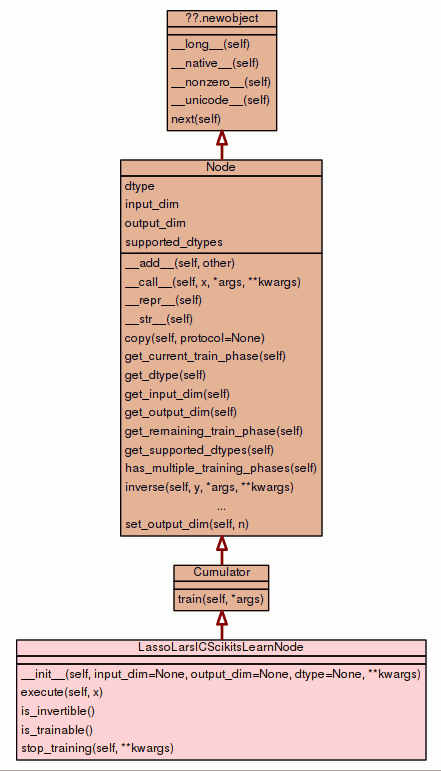
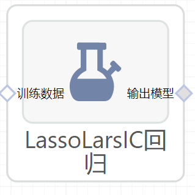

# LassoLarsIC回归使用文档
| 组件名称 | LassoLarsIC回归|  |  |
| --- | --- | --- | --- |
| 工具集 | 机器学习 |  |  |
| 组件作者 | 雪浪云-墨文 |  |  |
| 文档版本 | 1.0 |  |  |
| 功能 | LassoLarsIC回归算法|  |  |
| 镜像名称 | ml_components:3 |  |  |
| 开发语言 | Python |  |  |

## 组件原理
LassoLarsIC类的损失函数和损失函数的优化方法完全与LassoLarsCV类相同，区别在于验证方法。
### 验证方法

 LassoLarsIC类对超参数α没有使用交叉验证，而是用 Akaike信息准则(AIC)和贝叶斯信息准则(BIC)。此时我们并不需要指定备选的α值，而是由LassoLarsIC类基于AIC和BIC自己选择。用LassoLarsIC类我们可以一轮找到超参数α，而用K折交叉验证的话，我们需要K+1轮才能找到。相比之下LassoLarsIC类寻找α更快。

###使用场景

从验证方法可以看出，验证αLassoLarsIC比LassoLarsCV快很多。那么是不是LassoLarsIC类一定比LassoLarsCV类好呢？ 不一定！由于使用了AIC和BIC准则，我们的数据必须满足一定的条件才能用LassoLarsIC类。这样的准则需要对解的自由度做一个适当的估计。该估计是来自大样本（渐近结果），并假设该模型是正确的（即这些数据确实是由假设的模型产生的）。当待求解的问题的条件数很差的时候（比如特征个数大于样本数量的时候），这些准则就会有崩溃的风险。所以除非我们知道数据是来自一个模型确定的大样本，并且样本数量够大，我们才能用LassoLarsIC。而实际上我们得到的数据大部分都不能满足这个要求，实际应用中我没有用到过这个看上去很美的类。

## 输入桩
支持单个csv文件输入。
### 输入端子1

- **端口名称**：训练数据
- **输入类型**：Csv文件
- **功能描述**： 输入用于训练的数据
## 输出桩
支持sklearn模型输出。
### 输出端子1

- **端口名称**：输出模型
- **输出类型**：sklearn模型
- **功能描述**： 输出训练好的模型用于预测
## 参数配置
### criterion

- **功能描述**:使用的标准类型。‘bic’ | ‘aic’。
- **必选参数**：是
- **默认值**：aic
### Fit Intercept

- **功能描述**:是否计算该模型的截距。
- **必选参数**：是
- **默认值**：true
### verbose:

- **功能描述**：是否输出log。
- **必选参数**：是
- **默认值**：false
### normalize

- **功能描述**:当fit_intercept设置为False时，将忽略该参数。
- **必选参数**：是
- **默认值**：true
### precompute

- **功能描述**:是否使用预先计算好的Gram矩阵来加速计算。
- **必选参数**：是
- **默认值**：auto
### Max Iter

- **功能描述**：模型训练时的最大迭代次数，默认为1000
- **必选参数**：是
- **默认值**：500
### eps

- **功能描述**:计算Cholesky对角因子的机器精度正则化。
- **必选参数**：否
- **默认值**：（无）
### Copy X

- **功能描述**:如果为真，则复制X;否则，它可能被覆盖。
- **必选参数**：是
- **默认值**：false
### positive

- **功能描述**:限制系数为>= 0。
- **必选参数**：是
- **默认值**：false
### 需要训练

- **功能描述**：该模型是否需要训练，默认为需要训练。
- **必选参数**：是
- **默认值**：true
### 特征字段

- **功能描述**：特征字段
- **必选参数**：是
- **默认值**：（无）
### 识别字段

- **功能描述**：识别字段
- **必选参数**：是
- **默认值**：（无）
## 使用方法
- 将组件拖入到项目中
- 与前一个组件输出的端口连接（必须是csv类型）
- 点击运行该节点

