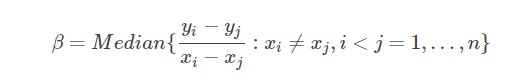
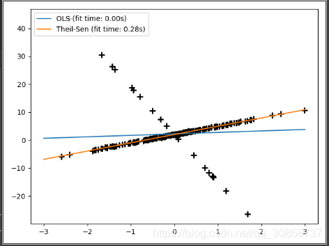

# Theil-Sen回归（TheilSenRegressor）使用文档
| 组件名称 |Theil-Sen回归（TheilSenRegressor）|  |  |
| --- | --- | --- | --- |
| 工具集 | 机器学习 |  |  |
| 组件作者 | 雪浪云-墨文 |  |  |
| 文档版本 | 1.0 |  |  |
| 功能 | Theil-Sen回归（TheilSenRegressor）算法|  |  |
| 镜像名称 | ml_components:3 |  |  |
| 开发语言 | Python |  |  |

## 组件原理
Theil-Sen回归是一个参数中值估计器，它适用泛化中值，对多维数据进行估计，因此其对多维的异常点（outliers 外点）有很强的稳健性。

一般的回归模型为：y=α+βx+ϵ

其中，α,β 模型的参数，而 ϵ 为模型的随机误差。

Theil-Sen回归则是这么处理的：

在实践中发现，随着数据特征维度的提升，Theil-Sen回归的效果不断的下降，在高维数据中，Theil-Sen回归的效果有时甚至还不如OLS（最小二乘）。

OLS方法是渐进无偏的，Theil-Sen方法在渐进无偏方面和OLS性能相似。和OLS方法不同的是，Theil-Sen方法是一种非参数方法，其对数据的潜在分布不做任何的假设。Theil-Sen方法是一种基于中值的估计其，所以其对异常点有更强的稳健性。

## 输入桩
支持单个csv文件输入。
### 输入端子1

- **端口名称**：训练数据
- **输入类型**：Csv文件
- **功能描述**： 输入用于训练的数据
## 输出桩
支持sklearn模型输出。
### 输出端子1

- **端口名称**：输出模型
- **输出类型**：sklearn模型
- **功能描述**： 输出训练好的模型用于预测
## 参数配置
### 计算截距

- **功能描述**：是否计算模型截距
- **必选参数**：是
- **默认值**：true
### 计算时使用的子样本数

- **功能描述**：计算时使用的子样本数
- **必选参数**：是
- **默认值**：10000
### 样本数

- **功能描述**：计算参数时所用的样本数
- **必选参数**：是
- **默认值**：（无）
### 最大迭代次数

- **功能描述**：模型训练时的最大迭代次数
- **必选参数**：是
- **默认值**：300
### 容忍误差

- **功能描述**：计算空间中位数时的容忍误差
- **必选参数**：是
- **默认值**：0.001
### Random State

- **功能描述**：随机数生成器
- **必选参数**：否
- **默认值**：（无）
### 并行度

- **功能描述**：交叉验证时使用的CPU核数
- **必选参数**：否
- **默认值**：（无）
### 需要训练

- **功能描述**：该模型是否需要训练，默认为需要训练。
- **必选参数**：是
- **默认值**：true
### 特征字段

- **功能描述**：特征字段
- **必选参数**：是
- **默认值**：（无）
### 识别字段

- **功能描述**：识别字段
- **必选参数**：是
- **默认值**：（无）
## 使用方法
- 将组件拖入到项目中
- 与前一个组件输出的端口连接（必须是csv类型）
- 点击运行该节点

