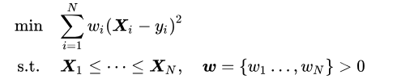
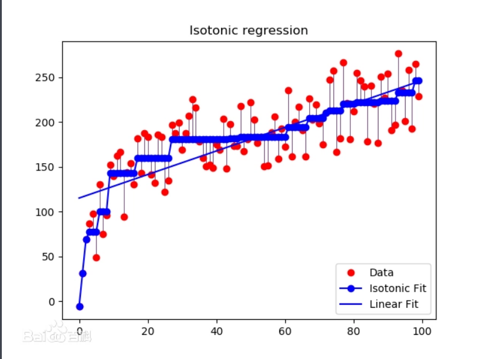
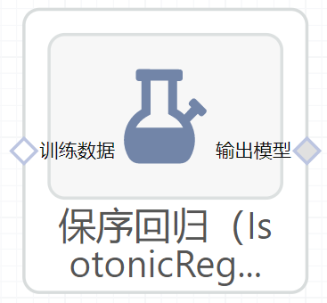

# 保序回归（IsotonicRegression）使用文档
| 组件名称 | 保序回归（IsotonicRegression）|  |  |
| --- | --- | --- | --- |
| 工具集 | 机器学习 |  |  |
| 组件作者 | 雪浪云-墨文 |  |  |
| 文档版本 | 1.0 |  |  |
| 功能 | 保序回归（IsotonicRegression）算法|  |  |
| 镜像名称 | ml_components:3 |  |  |
| 开发语言 | Python |  |  |

## 组件原理
保序回归（isotonic regression）或“单调回归（monotonic regression）”是回归分析的一种，是在单调的函数空间内对给定数据进行非参数估计的回归模型。

保序回归在观念上是寻找一组非递减的片段连续线性函数（piecewise linear continuous functions），即保序函数，使其与样本尽可能的接近。在计算中，保序回归是一个二次规划问题，即寻找一组保序函数是其对样本的估计值与样本的真实值间的离差平方和达到最小。

给定学习样本后，保序回归是一个加权最小二乘的二次规划问题

式中w为一组权重，要求必须为正值且个数与样本数相同，因此保序回归是非参数模型，其目标函数的复杂度与样本量有关

## 输入桩
支持单个csv文件输入。
### 输入端子1

- **端口名称**：训练数据
- **输入类型**：Csv文件
- **功能描述**： 输入用于训练的数据
## 输出桩
支持sklearn模型输出。
### 输出端子1

- **端口名称**：输出模型
- **输出类型**：sklearn模型
- **功能描述**： 输出训练好的模型用于预测
## 参数配置
### Y Min

- **功能描述**：最低预测值的下限
- **必选参数**：是
- **默认值**：（无）
### Y Max

- **功能描述**：最高预测值的上限
- **必选参数**：是
- **默认值**：（无）
### increasing

- **功能描述**：确定预测值应根据特征数据被限制为增加还是减少
- **必选参数**：是
- **默认值**：true
### Out Of Bounds

- **功能描述**：如何处理训练域外的X值
- **必选参数**：是
- **默认值**：nan
### 需要训练

- **功能描述**：该模型是否需要训练，默认为需要训练。
- **必选参数**：是
- **默认值**：true
### 特征字段

- **功能描述**：特征字段
- **必选参数**：是
- **默认值**：（无）
### 识别字段

- **功能描述**：识别字段
- **必选参数**：是
- **默认值**：（无）
## 使用方法
- 将组件拖入到项目中
- 与前一个组件输出的端口连接（必须是csv类型）
- 点击运行该节点

