# 内核岭回归（KernelRidge）使用文档
| 组件名称 | 内核岭回归（KernelRidge） |  |  |
| --- | --- | --- | --- |
| 工具集 | 机器学习 |  |  |
| 组件作者 | 雪浪云-墨文 |  |  |
| 文档版本 | 1.0 |  |  |
| 功能 | 内核岭回归（KernelRidge）|  |  |
| 镜像名称 | ml_components:3 |  |  |
| 开发语言 | Python |  |  |

## 组件原理
Kernel Ridge Regression(KRR，核脊回归) 是Ridge Regression(RR，脊回归)的kernel版本，与Support Vector Regression(SVR，支持向量回归)类似。

KRR与SVR的学习形式是相同的。两个都有l_2正则项，只是两者的损失函数不同。KRR使用的是均方误差，而SVR使用的是epsilon-insensitive的损失函数，即：

在训练的过程中，KRR能够得出解析解，而且在处理中度规模的数据集时，会很有速度；但是，在做预测时，因为KRR所学到的参数是非稀疏的，而SVR的是稀疏的，所以此时KRR速度会慢于SVR。

RR的最优解为：

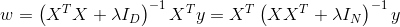

为了扩展到核空间，我们必须把这个参数w的最优转换成具有内积的形式。可以使用The matrix inverse lemma，重写为：

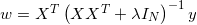

即，我们可以直接扩展在核空间下：

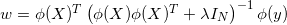

具体转换的过程如下：

The matrix inverse lemma为

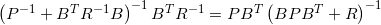

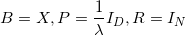

则有，

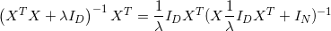

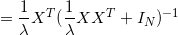

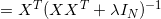

所以，

定义对偶变量alpha（dual variables）：

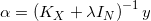

所以我们的原始变量w（primal variable）为：

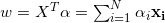

因此，w实际上是一个N个训练样本的线性组合形式。在计算预测均值时，我们会有：

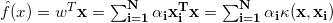

也就是，同理，我们令

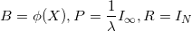

则有，

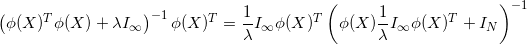

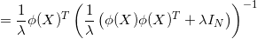

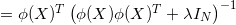

或者，我们可以写成：

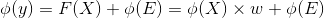

通过用Gram矩阵K代替XX^T，参数w转换成，

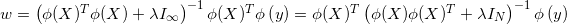

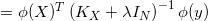

即估计的函数F为：

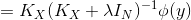

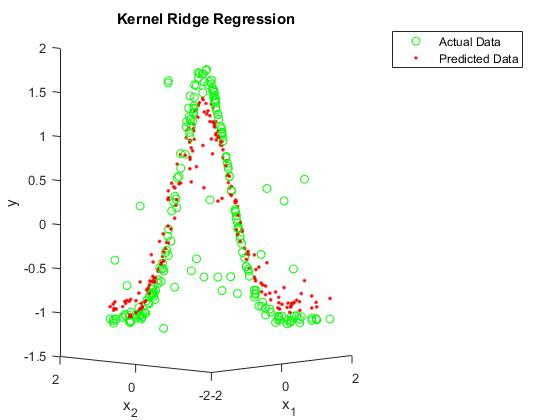

## 输入桩
支持单个csv文件输入。
### 输入端子1

- **端口名称**：训练数据
- **输入类型**：Csv文件
- **功能描述**： 输入用于训练的数据
## 输出桩
支持sklearn模型输出。
### 输出端子1

- **端口名称**：输出模型
- **输出类型**：sklearn模型
- **功能描述**： 输出训练好的模型用于预测
## 参数配置
### alpha

- **功能描述**：小的正alpha值改善了问题的条件，减少了估计的方差。
- **必选参数**：是
- **默认值**：1
### kerne

- **功能描述**：内部使用的内核映射。linear，precomputed。
- **必选参数**：是
- **默认值**：linear
### gamma

- **功能描述**：RBF、拉普拉斯、多项式、指数chi2和sigmoid函数的gamma参数。
- **必选参数**：否
- **默认值**：（无）
### degree

- **功能描述**：多项式核的次数。
- **必选参数**：是
- **默认值**：3
### coef0

- **功能描述**：多项式和sigmoid的零系数
- **必选参数**：是
- **默认值**：1
### 需要训练

- **功能描述**：该模型是否需要训练，默认为需要训练。
- **必选参数**：是
- **默认值**：true
### 特征字段

- **功能描述**：特征字段
- **必选参数**：是
- **默认值**：（无）
### 识别字段

- **功能描述**：识别字段
- **必选参数**：是
- **默认值**：（无）
## 使用方法
- 将组件拖入到项目中
- 与前一个组件输出的端口连接（必须是csv类型）
- 点击运行该节点

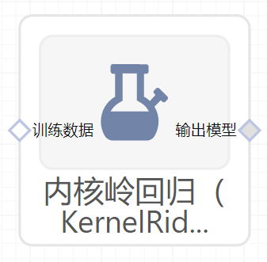

