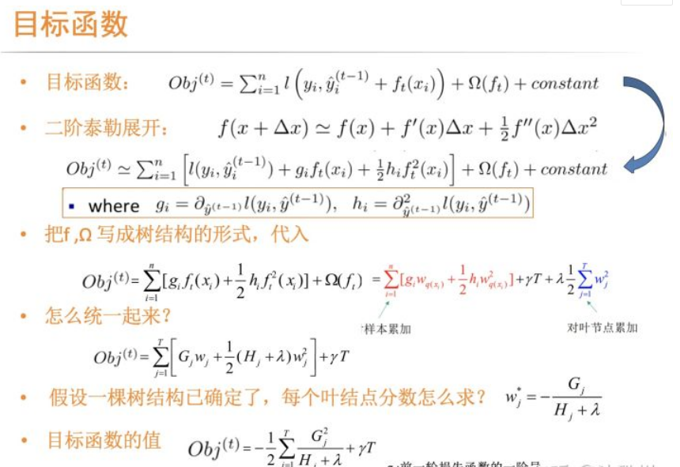

# XGBoost回归（带参数调优）使用文档
| 组件名称 |XGBoost回归（带参数调优）|  |  |
| --- | --- | --- | --- |
| 工具集 | 机器学习 |  |  |
| 组件作者 | 雪浪云-墨文 |  |  |
| 文档版本 | 1.0 |  |  |
| 功能 |XGBoost回归（带参数调优）算法|  |  |
| 镜像名称 | ml_components:3 |  |  |
| 开发语言 | Python |  |  |

## 组件原理
带参数调优给定参数的范围，在某个空间搜索最优参数，并得到最终的训练模型。

GBDT（Gradient Boosting Decision Tree) ，是一种广泛应用于回归、分类、排序的机器学习算法。从定义上对GBDT拆解，就是GB和DT两部分。

- DT, 决策树（Decision Tree），决策树是易于可视化、可解释性相对较强的算法，GBDT的基学习器具体为CART回归树。如图，从结构上来看，CART回归树是一个二叉树，其非叶节点对应着特征的最优切分点，每个叶节点对应着数据空间中的一片区域，落入此区域的x的预测值为该叶子节点的值。比如图中预测一个人是否喜欢玩电脑游戏, 如果年龄小于15且是男性，则预测值是2 。需要说明的是，GBDT不论做分类还是回归，这里用到的都是CART回归树。对于回归问题，预测分数可以直接作为目标值，对于分类问题，需要进一步将分数映射成概率值，比如选用sigmoid进行映射。因为GBDT每一轮的训练都是在上一轮训练的残差基础之上进行拟合，所以最终的预测结果是每一轮的结果相加，那么也就要求相加的结果是有意义的，如果用分类树，结果：是+否+否，就没有意义了，而回归树的数值相加是可行的。
- GB，梯度提升（Gradient Boosting）。首先需要了解 boosting，作为ensemble learning的一种，boosting 是一种和 bagging很类似的技术，两者都是使用多个弱分类器来得到一个强的分类器，（所谓弱也没有特别弱，只是组合起来会比较强）。具体来说，bagging在训练过程中，各弱分类器之间无强依赖，可以并行训练。而boosting不同的弱学习器是通过串行训练得到的，在迭代的每一步所构建的弱学习器都是为了弥补已有学习的不足，区别在于不同的boosting方法采用何种的方式来弥补这个不足。比如Adaboost，采用的是增加上一轮学习错误的样本权重的策略，它的每次迭代后都会提高被误分样本的分布。单决策树算法简单易懂可解释性强，但过拟合风险很大应用场景有限。

XGBoost--X (Extreme) GBoosted, 本质上来说还是GBDT框架，但是力争把速度和效率发挥到极致，且在目标函数、求解方法、建树过程、系统实现等方面都做了一些优化。

XGB的目标函数由两部分组成：损失函数和正则化项。 其中损失函数是用来评估模型的预测值f(x)与真实值Y的差距，衡量的是模型的拟合误差 。而加入正则化项是它与GBDT在目标函数上的区别，正则化项来限制树模型的复杂度，防止过拟合。直接将正则项加入到目标函数中，每一轮迭代均在数学层面上进行了正则化，效果与可操作性大大提升。正则化项由两部分组成：叶子结点个数和叶节点的分数。叶节点个数越多，树的结构越复杂，过拟合风险也越高，这个很容易理解。而叶节点分数的形式，相当于在做L2正则，要求叶节点数值尽量不极端，因为叶节点分数过大的话留给后面的学习空间就少了。

与GBDT相比，XGB使用二阶泰勒展开，这样做的好处是：

- 模块化上，支持自定义损失函数，仅要求损失函数二阶可导即可
- 算法层面上，利用二阶导信息本身就能让梯度收敛更快更准

## 输入桩
支持单个csv文件输入。
### 输入端子1

- **端口名称**：训练数据
- **输入类型**：Csv文件
- **功能描述**： 输入用于训练的数据
## 输出桩
支持sklearn模型输出。
### 输出端子1

- **端口名称**：最佳参数的模型
- **输出类型**：sklearn模型
- **功能描述**： 输出训练好的模型用于预测
## 参数配置
### max_depth

- **功能描述**：树的最大深度.
- **必选参数**：是
- **参数样例**：range(10,100,10)
- **样例含义**：这个参数取10-100之间的数值，间隔为10，最终的取值就是10、20、30、40、...、100
### learning_rate增强学习率

- **功能描述**：增强学习率
- **必选参数**：是
- **参数样例**：0，1
- **样例含义**：这个参数从0到1随机取值
### n_estimators

- **功能描述**：树的数量
- **必选参数**：是
- **参数样例**：range(10,100,10)
- **样例含义**：这个参数取10-100之间的数值，间隔为10，最终的取值就是10、20、30、40、...、100
### booster 

- **功能描述**：指定要使用的增强器: gbtree, gblinear or dart.
- **必选参数**：是
- **参数样例**：多选
- **样例含义**：这个参数在gbtree、gblinear、dart中选取最优值
### gamma

- **功能描述**：在树的叶节点上进行进一步分区所需的最小损失减少。
- **必选参数**：是
- **参数样例**：0，1
- **样例含义**：这个参数从0到1随机取值
### min_child_weight

- **功能描述**： 子节点所需的最小实例权重总和(hessian).
- **必选参数**：是
- **参数样例**：range(10,100,10)
- **样例含义**：这个参数取10-100之间的数值，间隔为10，最终的取值就是10、20、30、40、...、100
### max_delta_step 

- **功能描述**：允许的每棵树权重估计的最大增量步长。
- **必选参数**：是
- **参数样例**：range(10,100,10)
- **样例含义**：这个参数取10-100之间的数值，间隔为10，最终的取值就是10、20、30、40、...、100
### subsample

- **功能描述**：训练实例的子样本比率
- **必选参数**：是
- **参数样例**：0，1
- **样例含义**：这个参数从0到1随机取值
### colsample_bytree

- **功能描述**： 构建每棵树时列的子样本比率
- **必选参数**：是 
- **参数样例**：0，1
- **样例含义**：这个参数从0到1随机取值
### colsample_bylevel 

- **功能描述**：每个层级的列的子样本比率。
- **必选参数**：是
- **参数样例**：0，1
- **样例含义**：这个参数从0到1随机取值
### reg_alpha 

- **功能描述**：权重的L1正则项
- **必选参数**：是
- **参数样例**：0，1
- **样例含义**：这个参数从0到1随机取值
### reg_lambda 

- **功能描述**：权重的L2正则项
- **必选参数**：是
- **参数样例**：0，1
- **样例含义**：这个参数从0到1随机取值
### scale_pos_weight

- **功能描述**： 正负权重的平衡。
- **必选参数**：否
- **参数样例**：0，1
- **样例含义**：这个参数从0到1随机取值
### base_score

- **功能描述**：所有实例的初始预测分数，全局偏差.
- **必选参数**：是
- **参数样例**：0，1
- **样例含义**：这个参数从0到1随机取值
### Random State

- **功能描述**：随机种子
- **必选参数**：是
- **参数样例**：10000
- **样例含义**：这个参数从0-10000随机选取一个值
### 测试比例

- **功能描述**：测试模型比例
- **必选参数**：是
- **默认值**：0.2
### 搜索次数

- **功能描述**：搜索次数
- **必选参数**：是
- **默认值**：1000
### 特征字段

- **功能描述**：特征字段
- **必选参数**：是
- **默认值**：（无）
### 标签字段

- **功能描述**：标签字段
- **必选参数**：是
- **默认值**：（无）
## 使用方法
- 将组件拖入到项目中
- 与前一个组件输出的端口连接（必须是csv类型）
- 点击运行该节点

