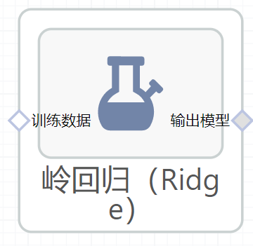

# 岭回归（Ridge）使用文档
| 组件名称 |岭回归（Ridge）|  |  |
| --- | --- | --- | --- |
| 工具集 | 机器学习 |  |  |
| 组件作者 | 雪浪云-墨文 |  |  |
| 文档版本 | 1.0 |  |  |
| 功能 | 岭回归（Ridge）算法|  |  |
| 镜像名称 | ml_components:3 |  |  |
| 开发语言 | Python |  |  |

## 组件原理
岭估计(Ridge estimate)是由Hoerl和Kennard于1970年提出的[Hoerl&Kennard1970]。自1970年以来，这种估计的研究和应用得到广泛重视，成为目前最有影响的一种有偏估计

岭回归又称脊回归，它的名字来源于模型的解与正则化参数λ之间的图像。

岭回归的性质如下：

比较重要的是性质3和4，性质3导致在岭回归中结果向中间靠拢，偏高和偏低的比较少；性质4是证明岭回归优于线性回归。

## 输入桩
支持单个csv文件输入。
### 输入端子1

- **端口名称**：训练数据
- **输入类型**：Csv文件
- **功能描述**： 输入用于训练的数据
## 输出桩
支持sklearn模型输出。
### 输出端子1

- **端口名称**：输出模型
- **输出类型**：sklearn模型
- **功能描述**： 输出训练好的模型用于预测
## 参数配置
### 正则化强度

- **功能描述**：正则化强度；必须是正浮点数
- **必选参数**：是
- **默认值**：1.0
### 计算截距

- **功能描述**：是否计算模型截距
- **必选参数**：是
- **默认值**：true
### 归一化

- **功能描述**：是否对数据进行归一化处理，该参数在Fit Intercept参数设为False时会被忽略
- **必选参数**：是
- **默认值**：false
### 最大迭代次数

- **功能描述**：模型训练时的最大迭代次数
- **必选参数**：是
- **默认值**：100
### 求解精度

- **功能描述**：求解的精确度
- **必选参数**：是
- **默认值**：0.001
### 求解器

- **功能描述**：选择模型的求解器
- **必选参数**：是
- **默认值**：auto
### Random State

- **功能描述**：当求解器为"sag"或者"saga"时，用来打乱数据
- **必选参数**：否
- **默认值**：（无）
### 需要训练

- **功能描述**：该模型是否需要训练，默认为需要训练。
- **必选参数**：是
- **默认值**：true
### 特征字段

- **功能描述**：特征字段
- **必选参数**：是
- **默认值**：（无）
### 识别字段

- **功能描述**：识别字段
- **必选参数**：是
- **默认值**：（无）
## 使用方法
- 将组件拖入到项目中
- 与前一个组件输出的端口连接（必须是csv类型）
- 点击运行该节点

