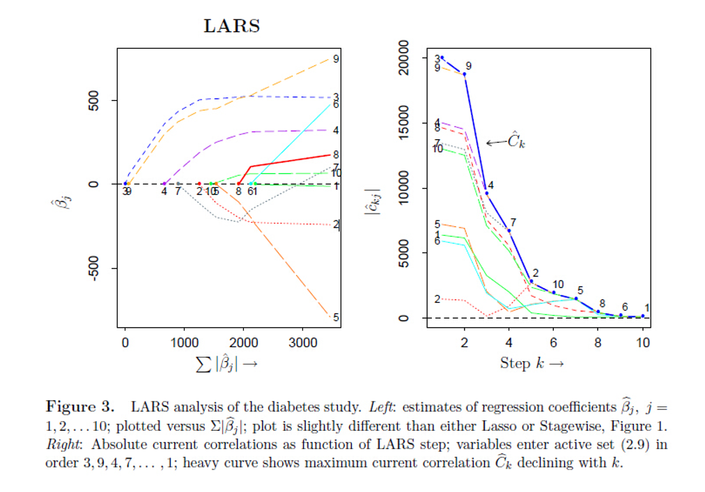
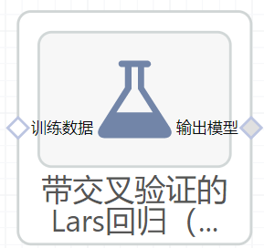

# 带交叉验证的Lars回归（LarsCV）使用文档
| 组件名称 | 带交叉验证的Lars回归（LarsCV）|  |  |
| --- | --- | --- | --- |
| 工具集 | 机器学习 |  |  |
| 组件作者 | 雪浪云-墨文 |  |  |
| 文档版本 | 1.0 |  |  |
| 功能 | 带交叉验证的Lars回归（LarsCV）算法|  |  |
| 镜像名称 | ml_components:3 |  |  |
| 开发语言 | Python |  |  |

## 组件原理
交叉验证，有的时候也称作循环估计（Rotation Estimation），是一种统计学上将数据样本切割成较小子集的实用方法，该理论是由Seymour Geisser提出的。在给定的建模样本中，拿出大部分样本进行建模型，留小部分样本用刚建立的模型进行预报，并求这小部分样本的预报误差，记录它们的平方加和。这个过程一直进行，直到所有的样本都被预报了一次而且仅被预报一次。把每个样本的预报误差平方加和，称为PRESS(predicted Error Sum of Squares)。

交叉验证的基本思想是把在某种意义下将原始数据(dataset)进行分组,一部分做为训练集(train set)，另一部分做为验证集(validation set or test set)。首先用训练集对分类器进行训练，再利用验证集来测试训练得到的模型(model)，以此来做为评价分类器的性能指标。

在统计学中，最小角度回归(LARS)是一种将线性回归模型拟合到高维空间的算法，由Bradley Efron、Trevor Hastie、Iain Johnstone和Robert Tibshirani开发。

假设我们期望一个响应变量由一个可能的协变量子集的线性组合决定。然后，LARS算法提供了一种方法来生成要包括哪些变量及其系数的估计值。

LARS解由一条曲线组成，表示参数L1范数参数向量的每个值的解，而不是给出向量结果。

LARS的算法实际执行步骤如下：

- 对Predictors进行标准化（去除不同尺度的影响），对Target Variable进行中心化（去除截距项的影响），初始的所有系数都设为0，此时残差 r 就等于中心化后的Target Variable
- 找出和残差r相关度最高的变量X_j
- 将X_j的系数Beta_j 从0开始沿着LSE（只有一个变量X_j的最小二乘估计）的方向变化，直到某个新的变量X_k与残差r的相关性大于X_j时
-  X_j和X_k的系数Beta_j和Beta_k，一起沿着新的LSE（加入了新变量X_k的最小二乘估计）的方向移动，直到有新的变量被选入
- 重复2，3，4，直到所有变量被选入，最后得到的估计就是普通线性回归的OLS

从上面这个算法可以看出，LARS这个东西明显和OLS, Ridge Regression等给出了Closed-form solutions的模型不同，而是给出了一套对计算机来说非常友好的算法。这也说明了随着计算机能力的强大，现代统计基本上越来越靠近算法，而和模型无关。

## 输入桩
支持单个csv文件输入。
### 输入端子1

- **端口名称**：训练数据
- **输入类型**：Csv文件
- **功能描述**： 输入用于训练的数据
## 输出桩
支持sklearn模型输出。
### 输出端子1

- **端口名称**：输出模型
- **输出类型**：sklearn模型
- **功能描述**： 输出训练好的模型用于预测
## 参数配置
### Fit Intercept

- **功能描述**:是否计算该模型的截距。
- **必选参数**：是
- **默认值**：true
### verbose

- **功能描述**:是否输出日志
- **必选参数**：否
- **默认值**：（无）
### Max Iter

- **功能描述**:最大迭代次数。
- **必选参数**：是
- **默认值**：100
### normalize

- **功能描述**:当fit_intercept设置为False时，将忽略该参数。若为真，则回归前对回归量X进行归一化处理，即减去均值，然后除以l2-范数。
- **必选参数**：是
- **默认值**：true
### cv

- **功能描述**:确定交叉验证分割策略。
- **必选参数**：是
- **默认值**：5
### precompute

- **功能描述**:是否使用预先计算好的Gram矩阵来加速计算。
- **必选参数**：是
- **默认值**：auto
### Max N Alphas

- **功能描述**:用于计算交叉验证中的残差的路径上的最大点数
- **必选参数**：是
- **默认值**：1000
### nJobs

- **功能描述**:交叉验证时使用的CPU个数。
- **必选参数**：否
- **默认值**：（无）
### eps

- **功能描述**:计算Cholesky对角因子的机器精度正则化。对于条件很差的系统，增加这个值。
- **必选参数**：否
- **默认值**：（无）
### Copy X

- **功能描述**:如果为真，则复制X;否则，它可能被覆盖。
- **必选参数**：否
- **默认值**：（无）
### 需要训练

- **功能描述**：该模型是否需要训练，默认为需要训练。
- **必选参数**：是
- **默认值**：true
### 特征字段

- **功能描述**：特征字段
- **必选参数**：是
- **默认值**：（无）
### 识别字段

- **功能描述**：识别字段
- **必选参数**：是
- **默认值**：（无）
## 使用方法
- 将组件拖入到项目中
- 与前一个组件输出的端口连接（必须是csv类型）
- 点击运行该节点

