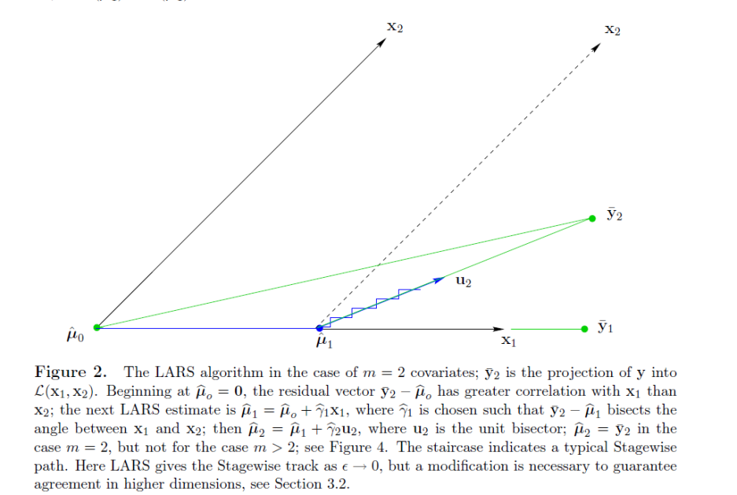
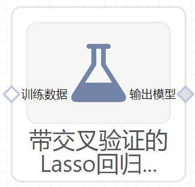

# 带交叉验证的Lasso回归（LassoCV）使用文档
| 组件名称 | 带交叉验证的Lasso回归（LassoCV）|  |  |
| --- | --- | --- | --- |
| 工具集 | 机器学习 |  |  |
| 组件作者 | 雪浪云-墨文 |  |  |
| 文档版本 | 1.0 |  |  |
| 功能 | 带交叉验证的Lasso回归（LassoCV）算法|  |  |
| 镜像名称 | ml_components:3 |  |  |
| 开发语言 | Python |  |  |

## 组件原理
交叉验证，有的时候也称作循环估计（Rotation Estimation），是一种统计学上将数据样本切割成较小子集的实用方法，该理论是由Seymour Geisser提出的。在给定的建模样本中，拿出大部分样本进行建模型，留小部分样本用刚建立的模型进行预报，并求这小部分样本的预报误差，记录它们的平方加和。这个过程一直进行，直到所有的样本都被预报了一次而且仅被预报一次。把每个样本的预报误差平方加和，称为PRESS(predicted Error Sum of Squares)。

交叉验证的基本思想是把在某种意义下将原始数据(dataset)进行分组,一部分做为训练集(train set)，另一部分做为验证集(validation set or test set)。首先用训练集对分类器进行训练，再利用验证集来测试训练得到的模型(model)，以此来做为评价分类器的性能指标。

LARS（Least Angle Regression）即最小角回归，作为Forward Stepwise（向前逐步回归）的升级版，LARS是每次先找出和因变量相关度最高的那个变量,在已经入选的变量中，寻找一个新的路径，使得在这个路径上前进时，当前残差与已入选变量的相关系数都是相同的，直到找出新的比当前残差相关系数最大的变量。从几何上来看，当前残差在那些已选入回归集的变量们所构成的空间中的投影，是这些变量的角平分线。  

Lasso(least absolute shrinkage and selection operator)线性回归的L1正则化通常称为Lasso回归,一般来说，对于高维的特征数据，尤其线性关系是稀疏的，我们会采用Lasso回归。或者是要在一堆特征里面找出主要的特征，那么Lasso回归更是首选了。Lasso回归的损失函数优化方法常用的有两种，坐标轴下降法和最小角回归法。Lasso类采用的是坐标轴下降法，后面讲到的LassoLars模型采用的是最小角回归法。

## 输入桩
支持单个csv文件输入。
### 输入端子1

- **端口名称**：训练数据
- **输入类型**：Csv文件
- **功能描述**： 输入用于训练的数据
## 输出桩
支持sklearn模型输出。
### 输出端子1

- **端口名称**：输出模型
- **输出类型**：sklearn模型
- **功能描述**： 输出训练好的模型用于预测
## 参数配置
### eps

- **功能描述**：路径长度
- **必选参数**：是
- **默认值**：0.001
### alpha数量

- **功能描述**：沿正则化路径的alpha数量
- **必选参数**：是
- **默认值**：100
### alpha

- **功能描述**：乘以L1项的常数
- **必选参数**：是
- **默认值**：1
### Fit Intercept

- **功能描述**:是否计算该模型的截距。
- **必选参数**：是
- **默认值**：true
### 是否进行归一化

- **功能描述**：是否对数据进行归一化处理，该参数在Fit Intercept参数设为False时会被忽略。
- **必选参数**：是
- **默认值**：false
### precompute

- **功能描述**:是否使用预先计算好的Gram矩阵来加速计算。
- **必选参数**：是
- **默认值**：auto
### 最大迭代次数

- **功能描述**：模型训练时的最大迭代次数，默认为1000
- **必选参数**：是
- **默认值**：1000
### tol

- **功能描述**：优化的容差
- **必选参数**：是
- **默认值**：0.0001
### cv

- **功能描述**：交叉验证拆分数量l
- **必选参数**：是
- **默认值**：5
### 并行度

- **功能描述**：交叉验证时使用的CPU核数
- **必选参数**：否
- **默认值**：（无）
### positive

- **功能描述**：若设为True，则将系数强制转换为正
- **必选参数**：是
- **默认值**：false
### Random State

- **功能描述**：伪随机数发生器的种子
- **必选参数**：否
- **默认值**：（无）
### selection

- **功能描述**：选择不同遍历模式
- **必选参数**：是
- **默认值**：cyclic
### 需要训练

- **功能描述**：该模型是否需要训练，默认为需要训练。
- **必选参数**：是
- **默认值**：true
### 特征字段

- **功能描述**：特征字段
- **必选参数**：是
- **默认值**：（无）
### 识别字段

- **功能描述**：识别字段
- **必选参数**：是
- **默认值**：（无）
## 使用方法
- 将组件拖入到项目中
- 与前一个组件输出的端口连接（必须是csv类型）
- 点击运行该节点

