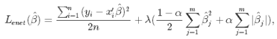
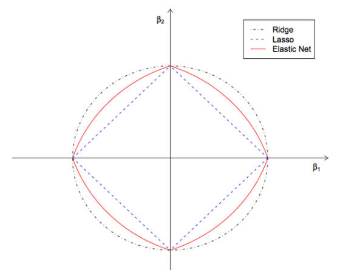

# 弹性网络回归（ElasticNet）使用文档
| 组件名称 | 弹性网络回归（ElasticNet）|  |  |
| --- | --- | --- | --- |
| 工具集 | 机器学习 |  |  |
| 组件作者 | 雪浪云-墨文 |  |  |
| 文档版本 | 1.0 |  |  |
| 功能 | 弹性网络回归（ElasticNet）|  |  |
| 镜像名称 | ml_components:3 |  |  |
| 开发语言 | Python |  |  |

## 组件原理
在统计学中，特别是在线性或逻辑回归模型的拟合中，弹性网络是一种正则化的回归方法，它将L1和L2惩罚值线性组合起来。

弹性网最初是由于对lasso的批评而出现的，lasso的变量选择可能过于依赖于数据，因此不稳定。解决方案是结合岭回归和lasso的惩罚项，以得到最好的模型。弹性网络的目标是使以下损失函数最小化:

现在,有两个参数需要调优:λ和α。

## 输入桩
支持单个csv文件输入。
### 输入端子1

- **端口名称**：训练数据
- **输入类型**：Csv文件
- **功能描述**： 输入用于训练的数据
## 输出桩
支持sklearn模型输出。
### 输出端子1

- **端口名称**：输出模型
- **输出类型**：sklearn模型
- **功能描述**： 输出训练好的模型用于预测
## 参数配置
### alpha

- **功能描述**:乘以惩罚项的常数。
- **必选参数**：是
- **默认值**：1
### L1 Ratio

- **功能描述**:弹性网混合参数，应该在0,1之间。
- **必选参数**：是
- **默认值**：0.5
### Fit Intercept

- **功能描述**:是否应该计算截距。
- **必选参数**：是
- **默认值**：true
### normalize

- **功能描述**:当fit_intercept设置为False时，将忽略该参数。若为真，则回归前对回归量X进行归一化处理，取均值减去后除以l2-范数。
- **必选参数**：是
- **默认值**：false
### Max Iter

- **功能描述**:最大迭代次数。
- **必选参数**：是
- **默认值**：1000
### Copy X

- **功能描述**:如果为真，则复制X;否则，它可能被覆盖。
- **必选参数**：是
- **默认值**：true
### tol

- **功能描述**:优化器的容忍度。
- **必选参数**：是
- **默认值**：0.0001
### Warm Start

- **功能描述**:当设置为True时，重用前一个解决方案来初始化，否则，只需擦除前一个解决方案。
- **必选参数**：是
- **默认值**：false
### positive

- **功能描述**:当设置为真时，强制系数为正。
- **必选参数**：是
- **默认值**：false
### Random State

- **功能描述**:随机种子。
- **必选参数**：否
- **默认值**：（无）
### selection

- **功能描述**:如果设置为“随机”，则每次迭代都会更新一个随机系数，而不是默认情况下按顺序遍历特性。
- **必选参数**：是
- **默认值**：cyclic
### 需要训练

- **功能描述**：该模型是否需要训练，默认为需要训练。
- **必选参数**：是
- **默认值**：true
### 特征字段

- **功能描述**：特征字段
- **必选参数**：是
- **默认值**：（无）
### 识别字段

- **功能描述**：识别字段
- **必选参数**：是
- **默认值**：（无）
## 使用方法
- 将组件拖入到项目中
- 与前一个组件输出的端口连接（必须是csv类型）
- 点击运行该节点

