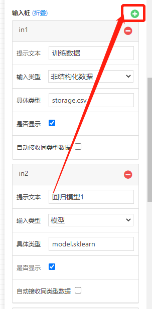
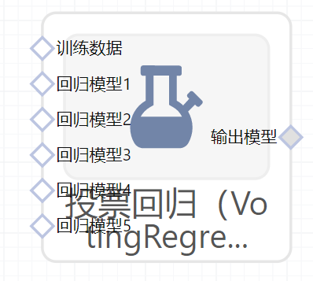

# 投票回归（VotingRegressor）使用文档
| 组件名称 | 投票回归（VotingRegressor）|  |  |
| --- | --- | --- | --- |
| 工具集 | 机器学习 |  |  |
| 组件作者 | 雪浪云-墨文 |  |  |
| 文档版本 | 1.0 |  |  |
| 功能 | 投票回归（VotingRegressor）算法|  |  |
| 镜像名称 | ml_components:3 |  |  |
| 开发语言 | Python |  |  |

## 组件原理
集成学习就是要发挥集体决策的优势，以单个分类模型的分类结果为基础，采用少数服从多数的原则确定模型预测的类别标签。通过多个模型的集成降低方差，从而提高模型的准确性。在理想情况下，投票法的预测效果应当优于任何一个基模型的预测效果。

回归投票法：预测结果是所有模型预测结果的平均值。

投票法的注意事项：

- 基模型之间的效果不能差别过大。当某个基模型相对于其他基模型效果过差时，该模型很可能成为噪声。
- 基模型之间应该有较小的同质性。例如在基模型预测效果近似的情况下，基于树模型与线性模型的投票，往往优于两个树模型或两个线性模型。
- 这意味着所有模型对预测的贡献是一样的。如果一些模型在某些情况下很好，而在其他情况下很差，这是使用投票法时需要考虑到的一个问题。

## 输入桩
支持单个csv文件输入。
### 输入端子1

- **端口名称**：训练数据
- **输入类型**：Csv文件
- **功能描述**： 输入用于训练的数据
### 输入端子2

- **端口名称**：输入模型
- **输入类型**：sklearn模型
- **功能描述**： 已经训练好的模型，默认提供了5个模型输入端口，如果在实际使用过程中端口不够，可以在节点后面板的输入桩一栏中，添加新的输入桩，，输入类型改为"模型"，如下图所示：

## 输出桩
支持sklearn模型输出。
### 输出端子1

- **端口名称**：输出模型
- **输出类型**：sklearn模型
- **功能描述**： 输出训练好的模型用于预测
## 参数配置
### 模型权重

- **功能描述**：输入模型在预测时的所占权重
- **必选参数**：是
- **默认值**：（无）
### 并行度

- **功能描述**：运行时的并行度
- **必选参数**：否
- **默认值**：（无）
### 需要训练

- **功能描述**：该模型是否需要训练，默认为需要训练。
- **必选参数**：是
- **默认值**：true
### 特征字段

- **功能描述**：特征字段
- **必选参数**：是
- **默认值**：（无）
### 识别字段

- **功能描述**：识别字段
- **必选参数**：是
- **默认值**：（无）
## 使用方法
- 将组件拖入到项目中
- 与前一个组件输出的端口连接（必须是csv类型）
- 点击运行该节点

