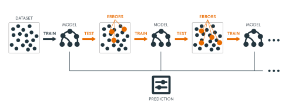

# 梯度提升决策树回归（GradientBoostingRegressor）使用文档
| 组件名称 | 梯度提升决策树回归（GradientBoostingRegressor） |  |  |
| --- | --- | --- | --- |
| 工具集 | 机器学习 |  |  |
| 组件作者 | 雪浪云-墨文 |  |  |
| 文档版本 | 1.0 |  |  |
| 功能 | 决策树回归（DecisionTreeRegressor）算法 |  |  |
| 镜像名称 | ml_components:3 |  |  |
| 开发语言 | Python |  |  |

## 组件原理
梯度增强是一种用于回归和分类问题的机器学习技术，它以弱预测模型(通常是决策树)集合的形式生成预测模型。它像其他增强算法一样，以阶段的方式构建模型，并通过允许优化任意可微分得损失函数来使模型通用化。

梯度增强的思想起源于Leo Breiman的观察，他认为梯度增强可以解释为一个合适的代价函数的优化算法。通过迭代选择一个指向负梯度方向的函数(弱假设)来优化函数空间上的代价函数的算法。这种函数梯度增强的观点导致了增强算法在机器学习和统计的许多领域的发展，包含了回归和分类领域。

Boosting算法实际上比较简单，它是一个循环过程。首先是用 Weak Learner 生成模型，然后再用 Weak Learner 去匹配前一次预测输出与实际值的残差，不断往复，最后的预测模型是所有这些 Weak Learner 预测模型的加和。

第一次模型F(x)的预测输出为y_pred, 第二次则使用x和y-y_pred去训练模型，模型为h(x)，实际预测的是第一次模型输出与实际值的残差，而这时整个预测模型为F(x)+h(x)

为什么 Boosting 算法总是要好一些呢？可以从原理上说明，损失函数在使用MSE时表示为

这里面F(x)是个变量，为了使损失变小，需要沿着梯度方向去更新F(x)

也就是在说使用MSE Loss的情况下，残差(Residual)是Loss对F的Gradient取负号。而H(x)=F(x)+h(x)视为对F(x)更新

所以通过匹配残差实际就是在沿着梯度方向来降低Loss函数，这就是解释了Boosting算法为什么能升算法的预测准确度。

## 输入桩
支持单个csv文件输入。
### 输入端子1

- **端口名称**：训练数据
- **输入类型**：Csv文件
- **功能描述**： 输入用于训练的数据
## 输出桩
支持sklearn模型输出。
### 输出端子1

- **端口名称**：输出模型
- **输出类型**：sklearn模型
- **功能描述**： 输出训练好的模型用于预测
## 参数配置
### loss

- **功能描述**：待优化的损失函数。可设置函数有{‘ls’, ‘lad’, ‘huber’, ‘quantile’}。
- **必选参数**：是
- **默认值**：ls
### Learning Rate

- **功能描述**：学习率通过learning_rate缩小了每棵树的贡献。
- **必选参数**：是
- **默认值**：0.1
### N Estimators

- **功能描述**：要执行的boosting个数。
- **必选参数**：是
- **默认值**：100
### subsample

- **功能描述**：用于拟合单个基础模型的样本比例。
- **必选参数**：是
- **默认值**：0.1
### criterion

- **功能描述**：用于测量分割质量的函数。支持标准有“mse“(均方根误差), “friedman_mse”（mean squared error with Friedman’s improvement score for potential splits）, “mae”（平均绝对误差）。
- **必选参数**：是
- **默认值**：friedman_mse
### Min Samples Split

- **功能描述**：分割内部节点所需的最小样本数。最小样本数或最小样本百分比
- **必选参数**：是
- **默认值**：2
### Min Samples Leaf

- **功能描述**：叶节点上所需的最小样本数。任何深度的分歧点只在它在左右分支中留下至少min_samples_leaf训练样本时才会被考虑。这可能有平滑模型的效果，特别是在回归中。
- **必选参数**：是
- **默认值**：1
### Min Weight Fraction Leaf

- **功能描述**：叶节点(所有输入样本)所需权值之和的最小加权分数。当不提供sample_weight时，示例具有相同的权重。
- **必选参数**：是
- **默认值**：0	

### Max Depth

- **功能描述**：单个回归器的最大深度。
- **必选参数**：是
- **默认值**：3
### Min Impurity Decreasee

- **功能描述**：如果分裂导致杂质的减少大于或等于这个值，一个节点就会分裂。
- **必选参数**：是
- **默认值**：0
### init

- **功能描述**：用于计算初始预测的估计器对象。
- **必选参数**：否
- **默认值**：（无）
### Random State

- **功能描述**：是随机数生成器使用的种子。
- **必选参数**：是
- **默认值**：0
### Max Features

- **功能描述**：是在寻找最佳分割时要考虑的特征数量。数值型时为特征数量，浮点数为特征百分比。“auto”（max_features=n_features），“sqrt”（max_features=sqrt(n_features)），
“log2”（max_features=log2(n_features)）。
- **必选参数**：否
- **默认值**：（无）
### alpha

- **功能描述**：huber和quantile损失函数的alpha值。
- **必选参数**：是
- **默认值**：0.9
### verbose

- **功能描述**：是否输出详细信息。
- **必选参数**：是
- **默认值**：0
### Max Leaf Nodes

- **功能描述**：使用max_leaf_nodes以最佳优先方式生成树。
- **必选参数**：否
- **默认值**：（无）
### Warm Start

- **功能描述**：当设置为True时，重用前一个调用的解决方案用于训练并向集成算法添加更多的估计器，否则，删除前面的解决方案。
- **必选参数**：是
- **默认值**：false
### presort

- **功能描述**：是否对数据进行预压缩，以加快拟合中最佳分割的发现。
- **必选参数**：是
- **默认值**：auto
### Validation Fraction

- **功能描述**：预留用于验证的训练数据的比例，用于提前停止训练。
- **必选参数**：是
- **默认值**：0.1
### N Iter No Change

- **功能描述**：n_iter_no_change用于判断在验证分数没有提高时是否使用early stop终止训练。
- **必选参数**：否
- **默认值**：（无）
### tol

- **功能描述**：early stop的容忍度。
- **必选参数**：否
- **默认值**：（无）
### 需要训练

- **功能描述**：该模型是否需要训练，默认为需要训练。
- **必选参数**：是
- **默认值**：true

### 特征字段

- **功能描述：** 特征字段
- **必选参数：** 是
- **默认值：** （无）

### 识别字段

- **功能描述：** 目标字段
- **必选参数：** 是
- **默认值：** （无）
## 使用方法
- 将组件拖入到项目中
- 与前一个组件输出的端口连接（必须是csv类型）
- 点击运行该节点

