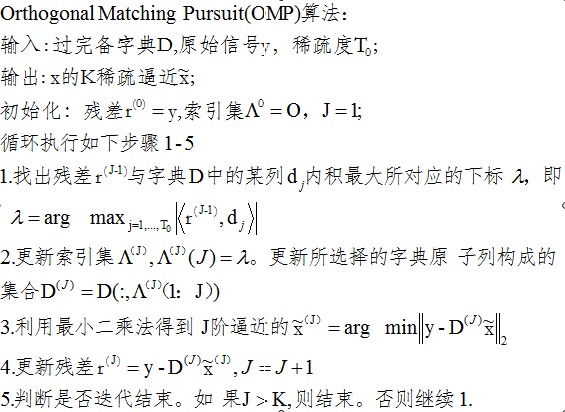
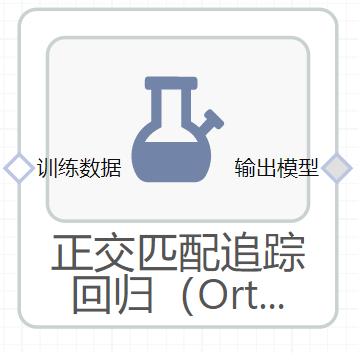

# 正交匹配追踪回归（OrthogonalMatchingPursuit）使用文档
| 组件名称 |正交匹配追踪回归（OrthogonalMatchingPursuit）|  |  |
| --- | --- | --- | --- |
| 工具集 | 机器学习 |  |  |
| 组件作者 | 雪浪云-墨文 |  |  |
| 文档版本 | 1.0 |  |  |
| 功能 | 正交匹配追踪回归（OrthogonalMatchingPursuit）算法|  |  |
| 镜像名称 | ml_components:3 |  |  |
| 开发语言 | Python |  |  |

## 组件原理
正交匹配追踪回归（OrthogonalMatchingPursuit）算法的本质思想是：以贪婪迭代的方法选择D的列，使得在每次迭代的过程中所选择的列与当前冗余向量最大程度的相关，从原始信号向量中减去相关部分并反复迭代，只到迭代次数达到稀疏度K，停止迭代。

核心算法步骤如下：

## 输入桩
支持单个csv文件输入。
### 输入端子1

- **端口名称**：训练数据
- **输入类型**：Csv文件
- **功能描述**： 输入用于训练的数据
## 输出桩
支持sklearn模型输出。
### 输出端子1

- **端口名称**：输出模型
- **输出类型**：sklearn模型
- **功能描述**： 输出训练好的模型用于预测
## 参数配置
### N Nonzero Coefs

- **功能描述**：解决方案中非零系数的期望数量
- **必选参数**：否
- **默认值**：（无）
### tol

- **功能描述**：残差的最大范数
- **必选参数**：否
- **默认值**：（无）
### Fit Intercept

- **功能描述**:：是否计算模型截距
- **必选参数**：是
- **默认值**：true
### 是否进行归一化

- **功能描述**：是否对数据进行归一化处理，该参数在Fit Intercept参数设为False时会被忽略。
- **必选参数**：是
- **默认值**：true
### 预先计算

- **功能描述**：是否使用预先计算好的矩阵来加速计算。
- **必选参数**：是
- **默认值**：auto
### 需要训练

- **功能描述**：该模型是否需要训练，默认为需要训练。
- **必选参数**：是
- **默认值**：true
### 特征字段

- **功能描述**：特征字段
- **必选参数**：是
- **默认值**：（无）
### 识别字段

- **功能描述**：识别字段
- **必选参数**：是
- **默认值**：（无）
## 使用方法
- 将组件拖入到项目中
- 与前一个组件输出的端口连接（必须是csv类型）
- 点击运行该节点

