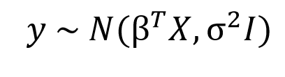
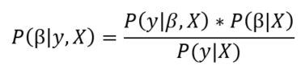
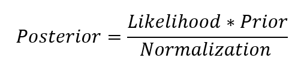
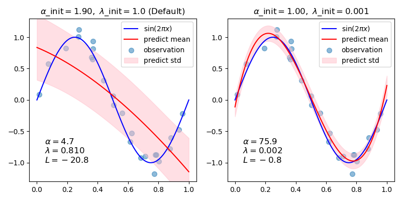
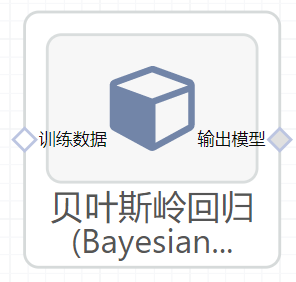

# 贝叶斯岭回归(Bayesian  Ridge)使用文档
| 组件名称 | 贝叶斯岭回归(Bayesian  Ridge) |  |  |
| --- | --- | --- | --- |
| 工具集 | 机器学习 |  |  |
| 组件作者 | 雪浪云-墨文 |  |  |
| 文档版本 | 1.0 |  |  |
| 功能 | 贝叶斯岭回归(Bayesian  Ridge)|  |  |
| 镜像名称 | ml_components:3 |  |  |
| 开发语言 | Python |  |  |

## 组件原理
在统计学中，贝叶斯线性回归是在贝叶斯推理的背景下进行统计分析的一种线性回归方法。当回归模型的误差服从正态分布时，如果假设某一特定形式的先验分布，则模型参数的后验概率分布可以得到显式的结果。

在贝叶斯观点中，我们使用概率分布而不是点估计来表示线性回归。响应y不是一个单独的值，而是假设从概率分布中得到的。以正态分布为样本，建立贝叶斯线性回归模型：

输出y是由正态(高斯)分布产生的，其特征是均值和方差。线性回归的均值是权矩阵的转置乘以预测矩阵。方差的平方标准差σ(乘以单位矩阵,因为这是一个多维模型的制定)。

贝叶斯线性回归的目的不是寻找模型参数的单一“最佳”值，而是确定模型参数的后验分布。不仅响应是由概率分布产生的，而且模型参数也假定是由分布产生的。模型参数的后验概率取决于训练输入和输出:

这里,P(β| y, X)模型的后验概率分布参数的输入和输出。这等于数据的可能性,P (y |β,X),乘以参数的先验概率,除以一个归一化常数。这是贝叶斯定理的一个简单表达，它是贝叶斯推理的基础:

让我们停下来想想这意味着什么。与OLS相比，模型参数的后验分布与数据的可能性乘以参数的先验概率成正比。在这里，我们可以观察到贝叶斯线性回归的两个主要好处。

- 先验:如果我们有领域知识，或者对模型参数应该是什么有一个猜测，我们可以将它们包含在我们的模型中，而不是像频域方法那样假设所有关于参数的知识都来自于数据。如果我们事先没有任何估计，我们可以对参数使用非信息性先验，比如正态分布。
- 后验:贝叶斯线性回归的结果是基于数据和先验的可能模型参数的分布。这允许我们量化模型的不确定性:如果我们有更少的数据点，后验分布将会更分散。

随着数据点数量的增加，似然性会冲掉先验，在无限数据的情况下，参数的输出收敛到OLS得到的值。

作为分布的模型参数的表达式封装了贝叶斯世界观:我们从一个初始估计开始，我们的先验，当我们收集更多的证据时，我们的模型变得不那么错误。贝叶斯推理是我们直觉的自然延伸。通常，我们有一个初始的假设，当我们收集支持或反对我们想法的数据时，我们改变了我们对世界的模型(理想情况下，这是我们推理的方式)!

## 输入桩
支持单个csv文件输入。
### 输入端子1

- **端口名称**：训练数据
- **输入类型**：Csv文件
- **功能描述**： 输入用于训练的数据
## 输出桩
支持sklearn模型输出。
### 输出端子1

- **端口名称**：输出模型
- **输出类型**：sklearn模型
- **功能描述**： 输出训练好的模型用于预测
## 参数配置
### nIter

- **功能描述**:最大迭代次数。
- **必选参数**：是
- **默认值**：300
### tol

- **功能描述**:如果w收敛，停止算法。
- **必选参数**：是
- **默认值**：0.001
###alpha1

- **功能描述**:超参数:形状参数的Gamma分布优先于alpha参数。
- **必选参数**：是
- **默认值**：0.000001
### alpha2

- **功能描述**:相对于alpha参数，Gamma分布先验的反尺度参数(速率参数)。
- **必选参数**：是
- **默认值**：0.000001
### lambda1

- **功能描述**:超参数:形状参数的Gamma分布优先于lambda参数。
- **必选参数**：是
- **默认值**：0.000001
### lambda2

- **功能描述**:超参数:相对于lambda参数，Gamma分布先验的反尺度参数(速率参数)。
- **必选参数**：是
- **默认值**：0.000001
### Compute Score

- **功能描述**: :如果为True，在优化的每次迭代中计算log边际似然。
- **必选参数**：是
- **默认值**：false
### Fit Intercept

- **功能描述**:是否计算该模型的截距。
- **必选参数**：是
- **默认值**：true
### normalize

- **功能描述**:当fit_intercept设置为False时，将忽略该参数。若为真，则回归前对回归量X进行归一化处理，取均值减去后除以l2-范数。
- **必选参数**：是
- **默认值**：false
### Copy X

- **功能描述**:如果为真，则复制X;否则，它可能被覆盖。
- **必选参数**：是
- **默认值**：true
### verbose

- **功能描述**:是否输出log。
- **必选参数**：是
- **默认值**：false
### 需要训练

- **功能描述**：该模型是否需要训练，默认为需要训练。
- **必选参数**：是
- **默认值**：true
### 特征字段

- **功能描述**：特征字段
- **必选参数**：是
- **默认值**：（无）
### 识别字段

- **功能描述**：识别字段
- **必选参数**：是
- **默认值**：（无）
## 使用方法
- 将组件拖入到项目中
- 与前一个组件输出的端口连接（必须是csv类型）
- 点击运行该节点

