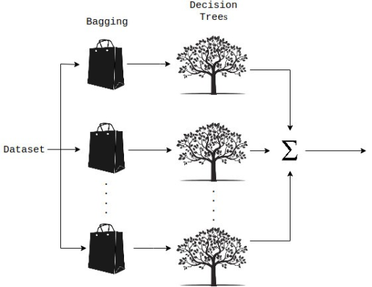

# 随机森林回归（RandomForestRegressor）使用文档
| 组件名称 | 随机森林回归（RandomForestRegressor） |  |  |
| --- | --- | --- | --- |
| 工具集 | 机器学习 |  |  |
| 组件作者 | 雪浪云-墨文 |  |  |
| 文档版本 | 1.0 |  |  |
| 功能 | 随机森林回归（RandomForestRegressor） |  |  |
| 镜像名称 | ml_components:3 |  |  |
| 开发语言 | Python |  |  |

## 组件原理
随机森林是一种集成的机器学习方法，能够使用多个决策树和统计技术（即bagging）执行回归和分类任务。Bagging和Boosting是两种最流行的集成技术，旨在解决高方差和高偏差。RF不只是对树的预测进行平均，它使用了两个关键概念，并因此得名random:

- 建立决策树时使用训练样本的随机抽样结果
- 分裂节点使用随机特征子集

换句话说，随机森林构建多个决策树，并将它们的预测合并在一起，从而获得更准确、更稳定的预测，而不是依赖于单个决策树。

随机森林中的每棵树都是从训练观察样本的随机抽样中学习。这些样本是通过有放回抽样取出，称之为bootstrapping，这意味着一些样本将在单个树中多次使用。这个想法是通过用不同的样本训练每棵树，虽然每棵树可能对特定的一组训练数据有很高的方差，但总体来说，整个森林的方差会更低，也不会以增加偏差为代价。在随机森林的Sklearn实现中，如果设置bootstrap=True，每棵树的子样本是通过有放回抽样取出，并且大小总是与原始输入相同，如果设置bootstrap=False，每棵树都将使用完全相同的数据集，没有任何随机性。

随机森林的另一个主要概念是，在决定拆分节点时，每棵树只能看到所有特征的子集。在Skearn中，这可以通过指定max_features = sqrt(n_features)来设置，这意味着如果每棵树的每个节点上有16个特性，那么将只考虑4个随机特征来分割节点。

随机森林的基本思想是将许多决策树的预测组合成一个模型。单独来看，决策树做出的预测可能并不准确，但综合起来，这些预测将更接近真实的平均值。

每棵树都有自己的信息源，因为它们在形成问题时考虑的是特征的随机子集，并且可以访问一组随机的训练数据点。如果我们只构建一棵树，我们将只利用它们有限的信息范围，但是通过将许多树的预测组合在一起，我们的净信息将会大得多。如果相反，每棵树都使用相同的数据集，那么每棵树都会受到异常或离群值的影响。

这增加了森林的多样性，导致了鲁棒性更强的整体预测。在进行预测时，随机森林回归模型会取所有决策树估计值的平均值。

## 输入桩
支持单个csv文件输入。
### 输入端子1

- **端口名称**：训练数据
- **输入类型**：Csv文件
- **功能描述**： 输入用于训练的数据
## 输出桩
支持sklearn模型输出。
### 输出端子1

- **端口名称**：输出模型
- **输出类型**：sklearn模型
- **功能描述**： 输出训练好的模型用于预测
## 参数配置
### N Estimators

- **功能描述**：森林中的树的个数。
- **必选参数**：是
- **默认值**：10
### criterion

- **功能描述**：用于测量分割质量的函数。支持的标准是均值平方误差的“mse”和均值绝对误差的“mae”。
- **必选参数**：是
- **默认值**：mse
### Max Depth

- **功能描述**：树的最大深度
- **必选参数**：否
- **默认值**：（无）
### Min Samples Split

- **功能描述**：分割内部节点所需的最小样本数。
- **必选参数**：是
- **默认值**：2
### Min Samples Leaf

- **功能描述**：叶节点上所需的最小样本数。
- **必选参数**：是
- **默认值**：1
### Min Weight Fraction Leaf

- **功能描述**：叶节点(所有输入样本)所需权值之和的最小加权分数。
- **必选参数**：是
- **默认值**：0
### Max Features

- **功能描述**：在寻找最佳分割时要考虑的特征数量。“auto”，“sqrt”，“log2”。
- **必选参数**：是
- **默认值**：auto
### Max Leaf Nodes

- **功能描述**：使用max_leaf_nodes以最佳优先方式生成树。
- **必选参数**：否
- **默认值**：（无）
### Min Impurity Decrease

- **功能描述**：如果分裂导致杂质的减少大于或等于这个值，一个节点就会分裂。
- **必选参数**：是
- **默认值**：0
### bootstrap

- **功能描述**：构建树时是否使用bootstrap样例。
- **必选参数**：是
- **默认值**：true
### Oob Score

- **功能描述**：是否使用袋外样品对未见数据进行R^2估计。
- **必选参数**：是
- **默认值**：false
### N Jobs

- **功能描述**：拟合和预测并行运行的作业数。
- **必选参数**：是
- **默认值**：1
### Random State

- **功能描述**：是随机数生成器使用的种子。
- **必选参数**：是
- **默认值**：0
### verbose

- **功能描述**：控制拟合和预测时的信息是否可见。
- **必选参数**：是
- **默认值**：0
### Warm Start

- **功能描述**：当设置为True时，重用上一个调用的解决方案以适应并向其中添加更多的估计器，否则，拟合一个全新的随机森林。
- **必选参数**：是
- **默认值**：false
### 需要训练

- **功能描述**：该模型是否需要训练，默认为需要训练。
- **必选参数**：是
- **默认值**：true

### 特征字段

- **功能描述：** 特征字段
- **必选参数：** 是
- **默认值：** （无）

### 识别字段

- **功能描述：** 目标字段
- **必选参数：** 是
- **默认值：** （无）
## 使用方法
- 将组件拖入到项目中
- 与前一个组件输出的端口连接（必须是csv类型）
- 点击运行该节点

