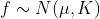
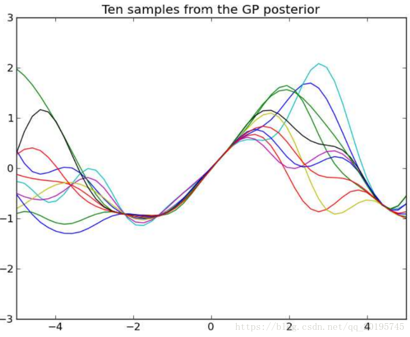
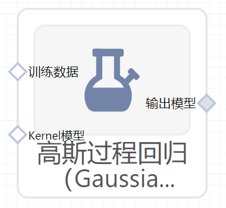

# 高斯过程回归（GaussianProcessRegressor）使用文档
| 组件名称 |高斯过程回归（GaussianProcessRegressor）|  |  |
| --- | --- | --- | --- |
| 工具集 | 机器学习 |  |  |
| 组件作者 | 雪浪云-墨文 |  |  |
| 文档版本 | 1.0 |  |  |
| 功能 | 高斯过程回归（GaussianProcessRegressor）算法|  |  |
| 镜像名称 | ml_components:3 |  |  |
| 开发语言 | Python |  |  |

## 组件原理
高斯过程（Gaussian Process, GP）是随机过程之一，是一系列符合正态分布的随机变量在一指数集（index set）内的集合

该解释中的“指数”可以理解为“维度“，按照机器学习的角度，各个指数上的随机变量可以对应地理解为各个维度上的特征。

高斯过程回归的和其他回归算法的区别是：一般回归算法给定输入X，希望得到的是对应的Y值，拟合函数可以有多种多样，线性拟合、多项式拟合等等，而高斯回归是要得到函数f(x)的分布

高斯回归首先要计算数据集中样本之间的联合概率分布, 

再根据需要预测的f*的先验概率分布与，来计算出f*的后验概率分布。

## 输入桩
支持单个csv文件输入。
### 输入端子1

- **端口名称**：训练数据
- **输入类型**：Csv文件
- **功能描述**： 输入用于训练的数据
### 输入端子2

- **端口名称**：核模型文件输入
- **输入类型**：sklearn模型
- **功能描述**：核模型文件输入，该输入桩可以不连
## 输出桩
支持sklearn模型输出。
### 输出端子1

- **端口名称**：输出模型
- **输出类型**：sklearn模型
- **功能描述**： 输出训练好的模型用于预测
## 参数配置
### alpha

- **功能描述**：训练期间添加到核矩阵对角线的值
- **必选参数**：是
- **默认值**：0.00000000001
### 优化器

- **功能描述**：优化核参数的优化器
- **必选参数**：是
- **默认值**：fmin_l_bfgs_b
### 重新启动次数

- **功能描述**：优化器为寻找内核参数而重新启动的次数
- **必选参数**：否
- **默认值**：（无）
### 归一化

- **功能描述**：标签Y是否进行归一化
- **必选参数**：是
- **默认值**：false
### Random State

- **功能描述**：当求解器为"sag"或者"saga"时，用来打乱数据
- **必选参数**：否
- **默认值**：（无）
### 需要训练

- **功能描述**：该模型是否需要训练，默认为需要训练。
- **必选参数**：是
- **默认值**：true
### 特征字段

- **功能描述**：特征字段
- **必选参数**：是
- **默认值**：（无）
### 识别字段

- **功能描述**：识别字段
- **必选参数**：是
- **默认值**：（无）
## 使用方法
- 将组件拖入到项目中
- 与前一个组件输出的端口连接（必须是csv类型）
- 点击运行该节点

