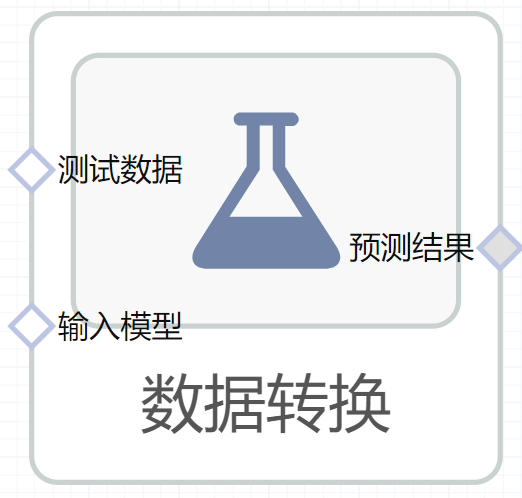

# 数据转换使用文档
| 组件名称 | 数据转换|  |  |
| --- | --- | --- | --- |
| 工具集 | 机器学习 |  |  |
| 组件作者 | 雪浪云-墨文 |  |  |
| 文档版本 | 1.0 |  |  |
| 功能 |数据转换算法 |  |  |
| 镜像名称 | ml_components:3 |  |  |
| 开发语言 | Python |  |  |

## 组件原理
数据转换组件使用算盘内已经训练好的模型（特征工程模型，例如标准归一化），以及需要转换的数据，进行数据转换。
## 输入桩
支持单个csv文件输入。
### 输入端子1

- **端口名称：** 待转换数据
- **输出类型：** Csv文件
- **功能描述：** 用于转换的数据
### 输入端子2

- **端口名称：** 输入模型
- **输出类型：** sklearn文件
- **功能描述：** 用于预测服务的模型节点，可以是导出的模型，也可以是一个模型训练组件的输出桩

## 输出桩
支持Csv文件输出。
### 输出端子1

- **端口名称：** 预测结果
- **输出类型：** Csv文件
- **功能描述：** 输出数据转换的结果
## 参数配置
### 覆盖原先的列

- **功能描述：** 转换的结果是否覆盖原先的列，默认不覆盖
- **必选参数：** 是
- **默认值：** false
### 目标字段

- **功能描述：** 目标字段
- **必选参数：** 是
- **默认值：** （无）
### 输出字段

- **功能描述：** 输出字段
- **必选参数：** 是
- **默认值：** （无）

## 使用方法
- 加组件拖入到项目中
- 与前一个组件输出的端口连接（必须是csv类型）
- 点击运行该节点

