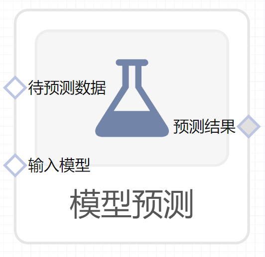

# 模型预测使用文档
| 组件名称 | 模型预测|  |  |
| --- | --- | --- | --- |
| 工具集 | 机器学习 |  |  |
| 组件作者 | 雪浪云-墨文 |  |  |
| 文档版本 | 1.0 |  |  |
| 功能 |模型预测算法 |  |  |
| 镜像名称 | ml_components:3 |  |  |
| 开发语言 | Python |  |  |

## 组件原理
模型预测组件使用算盘内已经训练好的模型，以及需要预测的数据，进行模型预测。
## 输入桩
支持单个csv文件输入。
### 输入端子1

- **端口名称：** 待预测数据
- **输出类型：** Csv文件
- **功能描述：** 用于预测的数据
### 输入端子2

- **端口名称：** 输入模型
- **输出类型：** sklearn文件
- **功能描述：** 用于预测服务的模型节点，可以是导出的模型，也可以是一个模型训练组件的输出桩

## 输出桩
支持Csv文件输出。
### 输出端子1

- **端口名称：** 预测结果
- **输出类型：** Csv文件
- **功能描述：** 输出模型预测的结果
## 参数配置
### 特征字段

- **功能描述：** 特征字段
- **必选参数：** 是
- **默认值：** （无）
### 预测字段

- **功能描述：** 预测字段
- **必选参数：** 是
- **默认值：** prediction

## 使用方法
- 加组件拖入到项目中
- 与前一个组件输出的端口连接（必须是csv类型）
- 点击运行该节点

