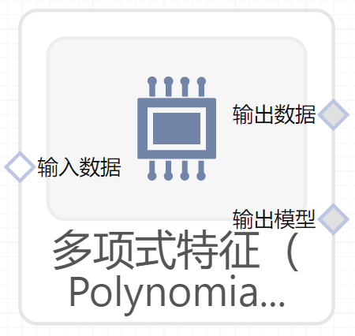

# 多项式特征（PolynomialFeatures）使用文档
| 组件名称 | 多项式特征（PolynomialFeatures） |  |  |
| --- | --- | --- | --- |
| 工具集 | 机器学习 |  |  |
| 组件作者 | 雪浪云-墨文 |  |  |
| 文档版本 | 1.0 |  |  |
| 功能 | 多项式特征（PolynomialFeatures）算法 |  |  |
| 镜像名称 | ml_components:3 |  |  |
| 开发语言 | Python |  |  |

## 组件原理
生成一个新的特征矩阵，该矩阵由所有特征的多项式组合而成，其度小于或等于指定的程度。例如，如果输入样本是二维的，且形式为[a，b]，则2次多项式特征为[1，a，b，a^2， ab， b^2]。

## 输入桩
支持单个csv文件输入。
### 输入端子1

- **端口名称：** 训练数据
- **输出类型：** Csv文件
- **功能描述：** 输入用于训练的数据

## 输出桩
支持Csv文件输出。
### 输出端子1

- **端口名称：** 输出数据
- **输出类型：** Csv文件
- **功能描述：** 输出处理后的结果数据
### 输出端子2

- **端口名称：** 输出模型
- **输出类型：** sklearn文件
- **功能描述：** 输出训练后的模型

## 参数配置
### 多项式次数

- **功能描述：** 多项式次数
- **必选参数：** 是
- **默认值：** 2
### 仅包含交互特征

- **功能描述**：若设置为True，则不会包含特征自己与自己结合产生的项
- **必选参数：** 是
- **默认值：** false
### 包含偏差

- **功能描述**：包含偏差列，即所有多项式的幂都为零的特征
- **必选参数：** 是
- **默认值：** true
### 顺序

- **功能描述**：输出数字的顺序
- **必选参数：** 是
- **默认值：** C
### 目标字段

- **功能描述：** 目标字段
- **必选参数：** 是
- **默认值：** （无）

## 使用方法
- 加组件拖入到项目中
- 与前一个组件输出的端口连接（必须是csv类型）
- 点击运行该节点

