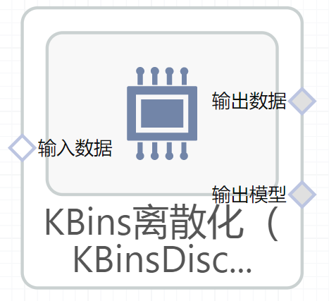

# KBins离散化（KBinsDiscretizer）使用文档
| 组件名称 | KBins离散化（KBinsDiscretizer） |  |  |
| --- | --- | --- | --- |
| 工具集 | 机器学习 |  |  |
| 组件作者 | 雪浪云-墨文 |  |  |
| 文档版本 | 1.0 |  |  |
| 功能 | KBins离散化（KBinsDiscretizer）算法 |  |  |
| 镜像名称 | ml_components:3 |  |  |
| 开发语言 | Python |  |  |

## 组件原理
将连续特征划分为离散特征值。 某些具有连续特征的数据集会受益于离散化，因为离散化可以把具有连续属性的数据集变换成只有名义属性(nominal attributes)的数据集。

## 输入桩
支持单个csv文件输入。
### 输入端子1

- **端口名称：** 训练数据
- **输出类型：** Csv文件
- **功能描述：** 输入用于训练的数据

## 输出桩
支持Csv文件输出。
### 输出端子1

- **端口名称：** 输出数据
- **输出类型：** Csv文件
- **功能描述：** 输出处理后的结果数据
### 输出端子2

- **端口名称：** 输出模型
- **输出类型：** sklearn文件
- **功能描述：** 输出训练后的模型
## 参数配置
### 桶个数

- **功能描述**：需要产生的分桶的个数
- **必选参数**：是
- **默认值**：5
### 编码

- **功能描述**：用于对转换后数据进行编码的策略	
- **必选参数**：是
- **默认值**：ordinal
### 策略

- **功能描述**：用于决定分桶宽度的方法
- **必选参数**：是
- **默认值**：quantile
### 目标字段

- **功能描述：** 目标字段
- **必选参数：** 是
- **默认值：** （无）

## 使用方法
- 加组件拖入到项目中
- 与前一个组件输出的端口连接（必须是csv类型）
- 点击运行该节点

