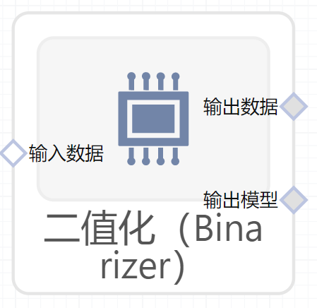

# 二值化（Binarizer）使用文档
| 组件名称 | 二值化（Binarizer）|  |  |
| --- | --- | --- | --- |
| 工具集 | 机器学习 |  |  |
| 组件作者 | 雪浪云-墨文 |  |  |
| 文档版本 | 1.0 |  |  |
| 功能 |二值化（Binarizer）算法 |  |  |
| 镜像名称 | ml_components:3 |  |  |
| 开发语言 | Python |  |  |

## 组件原理
根据阈值将数据进行二值化。

值大于阈值映射为1，而值小于或等于阈值映射为0。默认阈值为0时，只有正值映射为1。

二进制化是对文本计数数据的一种常见操作，分析人员可以决定只考虑功能的存在与否，而不是量化的出现次数。

它也可以作为考虑布尔随机变量的估计器的预处理步骤(例如，在贝叶斯设置中使用Bernoulli分布建模)。
## 输入桩
支持单个csv文件输入。
### 输入端子1

- **端口名称：** 训练数据
- **输出类型：** Csv文件
- **功能描述：** 输入用于训练的数据

## 输出桩
支持Csv文件输出。
### 输出端子1

- **端口名称：** 输出数据
- **输出类型：** Csv文件
- **功能描述：** 输出处理后的结果数据
### 输出端子2

- **端口名称：** 输出模型
- **输出类型：** sklearn文件
- **功能描述：** 输出训练后的模型
## 参数配置
### 阈值

- **功能描述：** 低于或等于此值的特征值被0替换，高于此值的被1替换
- **必选参数：** 是
- **默认值：** （无）
### 目标字段

- **功能描述：** 目标字段
- **必选参数：** 是
- **默认值：** （无）

## 使用方法
- 加组件拖入到项目中
- 与前一个组件输出的端口连接（必须是csv类型）
- 点击运行该节点

