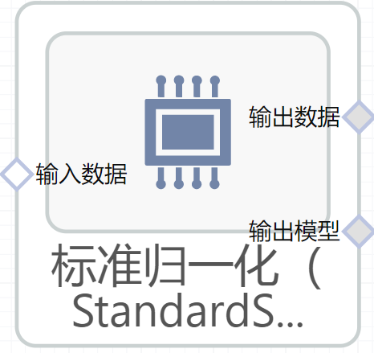

# 标准归一化（StandardScaler）使用文档
| 组件名称 | 标准归一化（StandardScaler）|  |  |
| --- | --- | --- | --- |
| 工具集 | 机器学习 |  |  |
| 组件作者 | 雪浪云-墨文 |  |  |
| 文档版本 | 1.0 |  |  |
| 功能 |标准归一化（StandardScaler）算法 |  |  |
| 镜像名称 | ml_components:3 |  |  |
| 开发语言 | Python |  |  |

## 组件原理
通过移除均值和缩放到单位方差来标准化特性。

样本的标准分数x计算如下：

Z=(x-u)/s

这里u是训练样本的平均值。

通过计算训练集中样本的相关统计量，对每个特征分别进行中心化和缩放。然后将均值和标准差存储在以后的数据上。

例如，在学习算法的目标函数中使用的许多元素(如支持向量机的RBF核或线性模型的L1和L2正则化器)假定所有特征都集中在0附近，并且具有相同的方差。如果一个特征的方差比其他特征大一个数量级，它可能支配目标函数，使估计器无法像预期的那样正确地学习其他特征。

此scsler还可以通过传递应用于稀疏CSR或CSC矩阵。
## 输入桩
支持单个csv文件输入。
### 输入端子1

- **端口名称：** 训练数据
- **输出类型：** Csv文件
- **功能描述：** 输入用于训练的数据

## 输出桩
支持Csv文件输出。
### 输出端子1

- **端口名称：** 输出数据
- **输出类型：** Csv文件
- **功能描述：** 输出处理后的结果数据
### 输出端子2

- **端口名称：** 输出模型
- **输出类型：** sklearn文件
- **功能描述：** 输出训练后的模型
## 参数配置
### 平均值

- **功能描述：** 缩放前将数据居中
- **必选参数：** 是
- **默认值：** true
### 标准差

- **功能描述：** 将数据换算成单位方差
- **必选参数：** 是
- **默认值：** true
### 目标字段

- **功能描述：** 目标字段
- **必选参数：** 是
- **默认值：** （无）

## 使用方法
- 加组件拖入到项目中
- 与前一个组件输出的端口连接（必须是csv类型）
- 点击运行该节点

