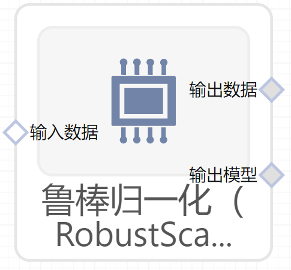

# 鲁棒归一化（RobustScaler）使用文档
| 组件名称 | 鲁棒归一化（RobustScaler）|  |  |
| --- | --- | --- | --- |
| 工具集 | 机器学习 |  |  |
| 组件作者 | 雪浪云-墨文 |  |  |
| 文档版本 | 1.0 |  |  |
| 功能 |鲁棒归一化（RobustScaler）算法 |  |  |
| 镜像名称 | ml_components:3 |  |  |
| 开发语言 | Python |  |  |

## 组件原理
使用统计数据进行缩放功能，这些统计数据对异常值具有很强的鲁棒性。

这个Scaler移除中位数，并根据分位数范围缩放数据(默认为IQR：Interquartile范围)。IQR是第一个四分位数(第25个分位数)和第三个四分位数(第75分位数)之间的范围。

通过计算训练集中样本的相关统计量，对每个特征分别进行中心化和缩放。然后将中间值和四分位数范围存储到以后的数据上，使用transform方法。

数据集的标准化是许多机器学习估计器的共同要求。通常，这是通过删除均值和缩放到单位方差来完成的。然而，异常值通常会以负值的方式影响样本的均值/方差。在这种情况下，中间值和四分位数的范围通常会得到更好的结果。
## 输入桩
支持单个csv文件输入。
### 输入端子1

- **端口名称：** 训练数据
- **输出类型：** Csv文件
- **功能描述：** 输入用于训练的数据

## 输出桩
支持Csv文件输出。
### 输出端子1

- **端口名称：** 输出数据
- **输出类型：** Csv文件
- **功能描述：** 输出处理后的结果数据
### 输出端子2

- **端口名称：** 输出模型
- **输出类型：** sklearn文件
- **功能描述：** 输出训练后的模型
## 参数配置
### 数据集中

- **功能描述：** 是否在数据缩放前，将数据进行集中
- **必选参数：** 是
- **默认值：** true
### 数据缩放

- **功能描述：** 是否将数据缩放到四分位范围
- **必选参数：** 是
- **默认值：** true
### 分位数下限

- **功能描述：** 分位数下限
- **必选参数：** 是
- **默认值：** 25
### 分位数上限

- **功能描述：** 分位数上限
- **必选参数：** 是
- **默认值：** 75
### 目标字段

- **功能描述：** 目标字段
- **必选参数：** 是
- **默认值：** （无）

## 使用方法
- 加组件拖入到项目中
- 与前一个组件输出的端口连接（必须是csv类型）
- 点击运行该节点

