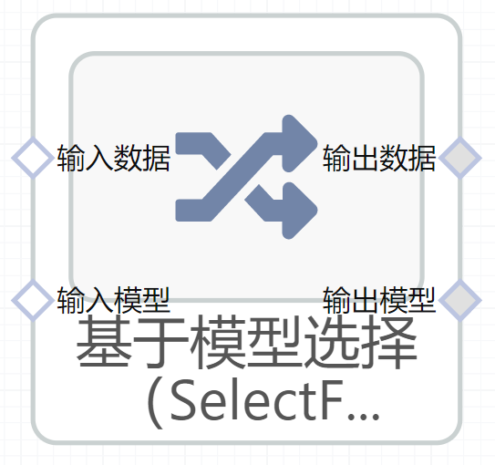

# 基于模型选择（SelectFromModel）使用文档
| 组件名称 | 基于模型选择（SelectFromModel）|  |  |
| --- | --- | --- | --- |
| 工具集 | 机器学习 |  |  |
| 组件作者 | 雪浪云-墨文 |  |  |
| 文档版本 | 1.0 |  |  |
| 功能 |基于模型选择（SelectFromModel）算法 |  |  |
| 镜像名称 | ml_components:3 |  |  |
| 开发语言 | Python |  |  |

## 组件原理
基于重要性权重选择特征。
## 输入桩
支持单个csv文件输入。
### 输入端子1

- **端口名称：** 训练数据
- **输出类型：** Csv文件
- **功能描述：** 输入用于训练的数据
### 输入端子2

- **端口名称：** 输入模型
- **输出类型：** sklearn文件
- **功能描述：** 后续用于训练的模型

## 输出桩
支持Csv文件输出。
### 输出端子1

- **端口名称：** 输出数据
- **输出类型：** Csv文件
- **功能描述：** 输出处理后的结果数据
### 输出端子2

- **端口名称：** 输出模型
- **输出类型：** sklearn文件
- **功能描述：** 输出训练后的模型
## 参数配置
### 阈值

- **功能描述：** 用于特征选择的阈值
- **必选参数：** 是
- **默认值：** （无）
### 模型是否已经经过训练

- **功能描述：** 模型是否已经经过训练
- **必选参数：** 是
- **默认值：** false
### 最大特征数

- **功能描述：** 最终选择的最大特征数量
- **必选参数：** 是
- **默认值：** 1
### 范数顺序

- **功能描述：** 用于过滤系数向量的范数顺序
- **必选参数：** 是
- **默认值：** （无）
### 特征字段

- **功能描述：** 特征字段
- **必选参数：** 是
- **默认值：** （无）
### 标签字段

- **功能描述：** 标签字段
- **必选参数：** 是
- **默认值：** （无）
### 输出字段

- **功能描述：** 输出字段
- **必选参数：** 是
- **默认值：** （无）

## 使用方法
- 加组件拖入到项目中
- 与前一个组件输出的端口连接（必须是csv类型）
- 点击运行该节点

