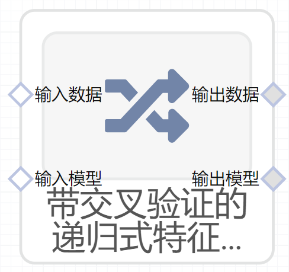

# 带交叉验证的递归式特征消除（RFECV）使用文档
| 组件名称 | 带交叉验证的递归式特征消除（RFECV）|  |  |
| --- | --- | --- | --- |
| 工具集 | 机器学习 |  |  |
| 组件作者 | 雪浪云-墨文 |  |  |
| 文档版本 | 1.0 |  |  |
| 功能 |带交叉验证的递归式特征消除（RFECV）算法 |  |  |
| 镜像名称 | ml_components:3 |  |  |
| 开发语言 | Python |  |  |

## 组件原理
递归特征消去与交叉验证，以选择的特征数量。

交叉验证，有的时候也称作循环估计（Rotation Estimation），是一种统计学上将数据样本切割成较小子集的实用方法，该理论是由Seymour Geisser提出的。在给定的建模样本中，拿出大部分样本进行建模型，留小部分样本用刚建立的模型进行预报，并求这小部分样本的预报误差，记录它们的平方加和。这个过程一直进行，直到所有的样本都被预报了一次而且仅被预报一次。把每个样本的预报误差平方加和，称为PRESS(predicted Error Sum of Squares)。

交叉验证的基本思想是把在某种意义下将原始数据(dataset)进行分组,一部分做为训练集(train set)，另一部分做为验证集(validation set or test set)。首先用训练集对分类器进行训练，再利用验证集来测试训练得到的模型(model)，以此来做为评价分类器的性能指标。

给定赋予特征权重的外部估计器(例如线性模型的系数)，递归特征消除(RFE)的目标是通过递归地考虑越来越小的特征集来选择特征。首先，对估计器进行关于初始特征集的训练，并通过任何特定的属性或可调用的属性获得每个特征的重要性。然后，将最不重要的特征从当前的一组特征中删除。该过程在剪枝集上递归重复，直到最终达到所需的要选择的功能数。
## 输入桩
支持单个csv文件输入。
### 输入端子1

- **端口名称：** 训练数据
- **输出类型：** Csv文件
- **功能描述：** 输入用于训练的数据
### 输入端子2

- **端口名称：** 输入模型
- **输出类型：** sklearn文件
- **功能描述：** 后续用于训练的模型

## 输出桩
支持Csv文件输出。
### 输出端子1

- **端口名称：** 输出数据
- **输出类型：** Csv文件
- **功能描述：** 输出处理后的结果数据
### 输出端子2

- **端口名称：** 输出模型
- **输出类型：** sklearn文件
- **功能描述：** 输出训练后的模型
## 参数配置
### 每次迭代去除的特征

- **功能描述：** 每次迭代去除的特征
- **必选参数：** 是
- **默认值：** 1
### 最小特征数

- **功能描述：** 最小特征数
- **必选参数：** 是
- **默认值：** 1
### 交叉验证拆分数量

- **功能描述：** 交叉验证拆分数量
- **必选参数：** 是
- **默认值：** 2
### 记分函数

- **功能描述：** 记分函数
- **必选参数：** 是
- **默认值：**（无）
### 并行度

- **功能描述：** 进行计算时的并行度
- **必选参数：** 否
- **默认值：** （无）
### verbose

- **功能描述：** 输出日志的冗余度
- **必选参数：** 否
- **默认值：** （无）
### 特征字段

- **功能描述：** 特征字段
- **必选参数：** 是
- **默认值：** （无）
### 标签字段

- **功能描述：** 标签字段
- **必选参数：** 是
- **默认值：** （无）
### 输出字段

- **功能描述：** 输出字段
- **必选参数：** 是
- **默认值：** （无）

## 使用方法
- 加组件拖入到项目中
- 与前一个组件输出的端口连接（必须是csv类型）
- 点击运行该节点

