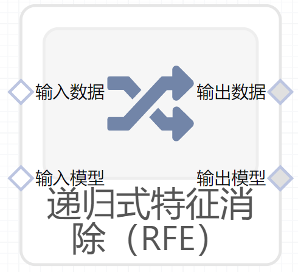

# 递归式特征消除（RFE）使用文档
| 组件名称 | 递归式特征消除（RFE）|  |  |
| --- | --- | --- | --- |
| 工具集 | 机器学习 |  |  |
| 组件作者 | 雪浪云-墨文 |  |  |
| 文档版本 | 1.0 |  |  |
| 功能 |递归式特征消除（RFE）算法 |  |  |
| 镜像名称 | ml_components:3 |  |  |
| 开发语言 | Python |  |  |

## 组件原理
特征排序与递归特征消除。

给定赋予特征权重的外部估计器(例如线性模型的系数)，递归特征消除(RFE)的目标是通过递归地考虑越来越小的特征集来选择特征。首先，对估计器进行关于初始特征集的训练，并通过任何特定的属性或可调用的属性获得每个特征的重要性。然后，将最不重要的特征从当前的一组特征中删除。该过程在剪枝集上递归重复，直到最终达到所需的要选择的功能数。
## 输入桩
支持单个csv文件输入。
### 输入端子1

- **端口名称：** 训练数据
- **输出类型：** Csv文件
- **功能描述：** 输入用于训练的数据
### 输入端子2

- **端口名称：** 输入模型
- **输出类型：** sklearn文件
- **功能描述：** 后续用于训练的模型

## 输出桩
支持Csv文件输出。
### 输出端子1

- **端口名称：** 输出数据
- **输出类型：** Csv文件
- **功能描述：** 输出处理后的结果数据
### 输出端子2

- **端口名称：** 输出模型
- **输出类型：** sklearn文件
- **功能描述：** 输出训练后的模型
## 参数配置
### 特征数

- **功能描述：** 最终选择的特征的数量
- **必选参数：** 是
- **默认值：** （无）
### 每次迭代去除的特征

- **功能描述：** 每次迭代去除的特征
- **必选参数：** 是
- **默认值：** 1
### verbose

- **功能描述：** 输出日志的冗余度
- **必选参数：** 否
- **默认值：** （无）
### 特征字段

- **功能描述：** 特征字段
- **必选参数：** 是
- **默认值：** （无）
### 标签字段

- **功能描述：** 标签字段
- **必选参数：** 是
- **默认值：** （无）
### 输出字段

- **功能描述：** 输出字段
- **必选参数：** 是
- **默认值：** （无）

## 使用方法
- 加组件拖入到项目中
- 与前一个组件输出的端口连接（必须是csv类型）
- 点击运行该节点

