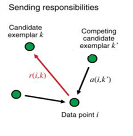

# AP聚类（AffinityPropagation）使用文档
| 组件名称 |AP聚类（AffinityPropagation）|  |  |
| --- | --- | --- | --- |
| 工具集 | 机器学习 |  |  |
| 组件作者 | 雪浪云-墨文 |  |  |
| 文档版本 | 1.0 |  |  |
| 功能 |AP聚类（AffinityPropagation）算法|  |  |
| 镜像名称 | ml_components:3 |  |  |
| 开发语言 | Python |  |  |

## 组件原理
BAP(Affinity Propagation)通常被翻译为近邻传播算法或者亲和力传播算法，是在2007年的Science杂志上提出的一种新的聚类算法。AP算法的基本思想是将全部数据点都当作潜在的聚类中心(称之为exemplar)，然后数据点两两之间连线构成一个网络(相似度矩阵)，再通过网络中各条边的消息(responsibility和availability)传递计算出各样本的聚类中心。

- 1）相似度： 点j作为点i的聚类中心的能力，记为S(i,j)。一般使用负的欧式距离，所以S(i,j)越大，表示两个点距离越近，相似度也就越高。使用负的欧式距离，相似度是对称的，如果采用其他算法，相似度可能就不是对称的。

- 2）相似度矩阵：N个点之间两两计算相似度，这些相似度就组成了相似度矩阵。如图1所示的黄色区域，就是一个5*5的相似度矩阵(N=5)

- 3)  preference：指点i作为聚类中心的参考度(不能为0)，取值为S对角线的值(图1红色标注部分)，此值越大，最为聚类中心的可能性就越大。但是对角线的值为0，所以需要重新设置对角线的值，既可以根据实际情况设置不同的值，也可以设置成同一值。一般设置为S相似度值的中值。(有的说设置成S的最小值产生的聚类最少，但是在下面的算法中设置成中值产生的聚类是最少的) 

- 4）Responsibility(吸引度):指点k适合作为数据点i的聚类中心的程度，记为r(i,k)。如图2红色箭头所示，表示点i给点k发送信息，是一个点i选点k的过程。

- 5）Availability(归属度):指点i选择点k作为其聚类中心的适合程度，记为a(i,k)。如图3红色箭头所示，表示点k给点i发送信息，是一个点k选diani的过程。

- 6）exemplar：指的是聚类中心。

- 7）r (i, k)加a (i, k)越大,则k点作为聚类中心的可能性就越大,并且i点隶属于以k点为聚类中心的聚类的可能性也越大

 

## 输入桩
支持单个csv文件输入。
### 输入端子1

- **端口名称**：训练数据
- **输入类型**：Csv文件
- **功能描述**： 输入用于训练的数据
## 输出桩
支持sklearn模型输出。
### 输出端子1

- **端口名称**：输出模型
- **输出类型**：sklearn模型
- **功能描述**： 输出训练好的模型用于预测
### 输出端子2

- **端口名称**：输出数据
- **输出类型**：Csv文件
- **功能描述**： 聚类后的数据
## 参数配置
### 阻尼系数

- **功能描述**：阻尼系数(在0.5和1之间)是相对于输入值(加权1 -阻尼)保持当前值的程度。这是为了在更新这些值时避免数值振荡
- **必选参数**：是
- **默认值**：0.5
### 最大迭代次数

- **功能描述**：最大迭代次数
- **必选参数**：是
- **默认值**：200
### 收敛迭代次数

- **功能描述**：当达到估计的聚类数不变的迭代次数时，停止收敛
- **必选参数**：是
- **默认值**：15
### 首选项

- **功能描述**：每个点的首选项
- **必选参数**：是
- **默认值**：（无）
### 归属度

- **功能描述**：聚类完成后的类别数目
- **必选参数**：是
- **默认值**：5
### 需要训练

- **功能描述**：该模型是否需要训练，默认为需要训练。
- **必选参数**：是
- **默认值**：true
### 特征字段

- **功能描述**：特征字段
- **必选参数**：是
- **默认值**：（无）
### 识别字段

- **功能描述**：识别字段
- **必选参数**：是
- **默认值**：（无）
## 使用方法
- 将组件拖入到项目中
- 与前一个组件输出的端口连接（必须是csv类型）
- 点击运行该节点

