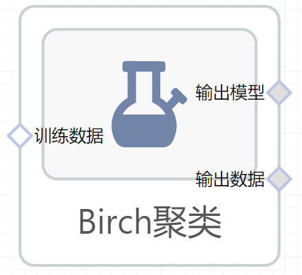

# Birch聚类使用文档
| 组件名称 |Birch聚类|  |  |
| --- | --- | --- | --- |
| 工具集 | 机器学习 |  |  |
| 组件作者 | 雪浪云-墨文 |  |  |
| 文档版本 | 1.0 |  |  |
| 功能 | Birch聚类算法|  |  |
| 镜像名称 | ml_components:3 |  |  |
| 开发语言 | Python |  |  |

## 组件原理
BIRCH的全称是利用层次方法的平衡迭代规约和聚类（Balanced Iterative Reducing and Clustering Using Hierarchies），名字实在是太长了，不过没关系，其实只要明白它是用层次方法来聚类和规约数据就可以了。刚才提到了，BIRCH只需要单遍扫描数据集就能进行聚类，那它是怎么做到的呢？

BIRCH算法利用了一个树结构来帮助我们快速的聚类，这个数结构类似于平衡B+树，一般将它称之为聚类特征树(Clustering Feature Tree，简称CF Tree)。这颗树的每一个节点是由若干个聚类特征(Clustering Feature，简称CF)组成。从下图我们可以看看聚类特征树是什么样子的：每个节点包括叶子节点都有若干个CF，而内部节点的CF有指向孩子节点的指针，所有的叶子节点用一个双向链表链接起来。

## 输入桩
支持单个csv文件输入。
### 输入端子1

- **端口名称**：训练数据
- **输入类型**：Csv文件
- **功能描述**： 输入用于训练的数据
## 输出桩
支持sklearn模型输出。
### 输出端子1

- **端口名称**：输出模型
- **输出类型**：sklearn模型
- **功能描述**： 输出训练好的模型用于预测
### 输出端子2

- **端口名称**：输出数据
- **输出类型**：Csv文件
- **功能描述**： 聚类后的数据
## 参数配置
### 半径阈值

- **功能描述**：过合并新样本和最近的子聚类获得的子聚类的半径应该小于阈值
- **必选参数**：是
- **默认值**：0.5
### 分支因子

- **功能描述**：每个节点中聚类特征子群集的最大数量
- **必选参数**：是
- **默认值**：50
### 类别数目

- **功能描述**：聚类完成后的类别数目
- **必选参数**：是
- **默认值**：3
### 计算标签

- **功能描述**：在每次的拟合时是否计算标签
- **必选参数**：是
- **默认值**：true
### 需要训练

- **功能描述**：该模型是否需要训练，默认为需要训练。
- **必选参数**：是
- **默认值**：true
### 特征字段

- **功能描述**：特征字段
- **必选参数**：是
- **默认值**：（无）
### 识别字段

- **功能描述**：识别字段
- **必选参数**：是
- **默认值**：（无）
## 使用方法
- 将组件拖入到项目中
- 与前一个组件输出的端口连接（必须是csv类型）
- 点击运行该节点

