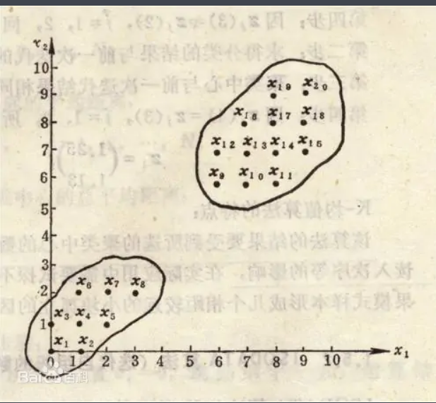

# K均值聚类(KMeans)使用文档
| 组件名称 |K均值聚类(KMeans)|  |  |
| --- | --- | --- | --- |
| 工具集 | 机器学习 |  |  |
| 组件作者 | 雪浪云-墨文 |  |  |
| 文档版本 | 1.0 |  |  |
| 功能 |K均值聚类(KMeans)算法|  |  |
| 镜像名称 | ml_components:3 |  |  |
| 开发语言 | Python |  |  |

## 组件原理
k均值聚类算法（k-means clustering algorithm）是一种迭代求解的聚类分析算法，其步骤是，预将数据分为K组，则随机选取K个对象作为初始的聚类中心，然后计算每个对象与各个种子聚类中心之间的距离，把每个对象分配给距离它最近的聚类中心。聚类中心以及分配给它们的对象就代表一个聚类。每分配一个样本，聚类的聚类中心会根据聚类中现有的对象被重新计算。这个过程将不断重复直到满足某个终止条件。终止条件可以是没有（或最小数目）对象被重新分配给不同的聚类，没有（或最小数目）聚类中心再发生变化，误差平方和局部最小。

先随机选取K个对象作为初始的聚类中心。然后计算每个对象与各个种子聚类中心之间的距离，把每个对象分配给距离它最近的聚类中心。聚类中心以及分配给它们的对象就代表一个聚类。一旦全部对象都被分配了，每个聚类的聚类中心会根据聚类中现有的对象被重新计算。这个过程将不断重复直到满足某个终止条件。终止条件可以是以下任何一个：

1)没有（或最小数目）对象被重新分配给不同的聚类。

2)没有（或最小数目）聚类中心再发生变化。

3)误差平方和局部最小。

## 输入桩
支持单个csv文件输入。
### 输入端子1

- **端口名称**：训练数据
- **输入类型**：Csv文件
- **功能描述**： 输入用于训练的数据
## 输出桩
支持sklearn模型输出。
### 输出端子1

- **端口名称**：输出模型
- **输出类型**：sklearn模型
- **功能描述**： 输出训练好的模型用于预测
### 输出端子2

- **端口名称**：输出数据
- **输出类型**：Csv文件
- **功能描述**： 聚类后的数据
## 参数配置
### 类别数目

- **功能描述**：要形成的簇的数量以及要生成的质心的数量
- **必选参数**：是
- **默认值**：8
### 初始化方式

- **功能描述**：初始化方式
- **必选参数**：是
- **默认值**：k-means++
### KMeans算法运行次数

- **功能描述**：使用不同质心种子运行KMeans算法的次数
- **必选参数**：是
- **默认值**：10
### 最大迭代次数

- **功能描述**：最大迭代次数
- **必选参数**：是
- **默认值**：300
### 相对容忍度

- **功能描述**：相对于两次连续迭代的聚类中心差异的Frobenius范数的相对容差
- **必选参数**：是
- **默认值**：0.0001
### KMeans算法

- **功能描述**：KMeans算法
- **必选参数**：是
- **默认值**：auto
### 需要训练

- **功能描述**：该模型是否需要训练，默认为需要训练。
- **必选参数**：是
- **默认值**：true
### 特征字段

- **功能描述**：特征字段
- **必选参数**：是
- **默认值**：（无）
### 识别字段

- **功能描述**：识别字段
- **必选参数**：是
- **默认值**：（无）
## 使用方法
- 将组件拖入到项目中
- 与前一个组件输出的端口连接（必须是csv类型）
- 点击运行该节点

