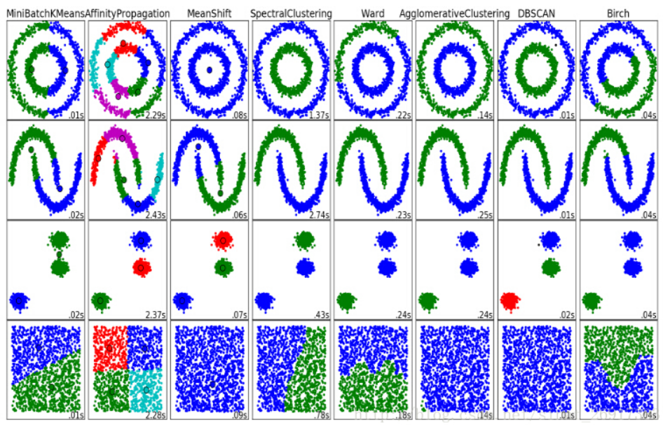
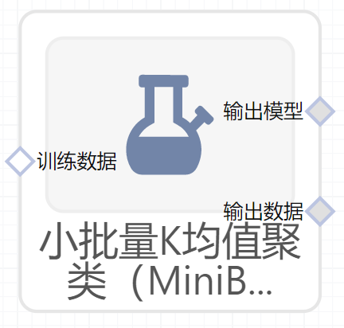

# MiniBatchK均值聚类（MiniBatchKMeans）使用文档
| 组件名称 |MiniBatchK均值聚类（MiniBatchKMeans）|  |  |
| --- | --- | --- | --- |
| 工具集 | 机器学习 |  |  |
| 组件作者 | 雪浪云-墨文 |  |  |
| 文档版本 | 1.0 |  |  |
| 功能 | MiniBatchK均值聚类（MiniBatchKMeans）算法|  |  |
| 镜像名称 | ml_components:3 |  |  |
| 开发语言 | Python |  |  |

## 组件原理
MiniBatchKMeans 是 KMeans 算法的一个变种，它使用小批量(mini-batches)来减少计算时间，而这多个批次仍然尝试优化相同的目标函数。小批量是输入数据的子集，在每次训练迭代中随机抽样。这些小批量大大减少了收敛到局部解所需的计算量。 与其他降低 k-means 收敛时间的算法不同，小批量 k-means 产生的结果通常只比标准算法略差。

该算法在两个步骤之间进行迭代，类似于 vanilla k-means 。在第一步， b 样本是从数据集中随机抽取的，形成一个小批量。然后将它们分配到最近的质心。 在第二步，质心被更新。与 k-means 不同, 该变种算法是基于每个样本(per-sample)。对于小批量中的每个样本，通过取样本的流平均值(streaming average)和分配给该质心的所有先前样本来更新分配的质心。 这具有随时间降低质心的变化率（rate of change）的效果。执行这些步骤直到达到收敛或达到预定次数的迭代。

## 输入桩
支持单个csv文件输入。
### 输入端子1

- **端口名称**：训练数据
- **输入类型**：Csv文件
- **功能描述**： 输入用于训练的数据
## 输出桩
支持sklearn模型输出。
### 输出端子1

- **端口名称**：输出模型
- **输出类型**：sklearn模型
- **功能描述**： 输出训练好的模型用于预测
### 输出端子2

- **端口名称**：输出数据
- **输出类型**：Csv文件
- **功能描述**： 聚类后的数据
## 参数配置
### 类别数目

- **功能描述**：要形成的簇的数量以及要生成的质心的数量
- **必选参数**：是
- **默认值**：8
### 最大迭代次数

- **功能描述**:最大迭代次数
- **必选参数**：是
- **默认值**：200
### 初始化方式：

- **功能描述**：初始化方式：
- **必选参数**：是
- **默认值**：k-means++
### 批大小

- **功能描述**：批大小
- **必选参数**：是
- **默认值**：100
### Random State

- **功能描述**：随机种子
- **必选参数**：否
- **默认值**：（无）
### 提前停止阈值

- **功能描述**：根据由平均中心平方位置变化的平滑、方差标准化测量的相对中心变化，控制提前停止
- **必选参数**：是
- **默认值**：0
### 平滑惯性没有提升的最大批次数

- **功能描述**：根据连续的未改善改善平滑惯性的小批量数量控制提前停止
- **必选参数**：是
- **默认值**：10
### 初始化样本数

- **功能描述**：为加速初始化而随机采样的样本数
- **必选参数**：否
- **默认值**：（无）
### 初始化次数

- **功能描述**：尝试的随机初始化次数
- **必选参数**：是
- **默认值**：3
### 重新分配比例

- **功能描述**：控制要重新分配的中心的最大比例
- **必选参数**：否
- **默认值**：（无）
### 需要训练

- **功能描述**：该模型是否需要训练，默认为需要训练。
- **必选参数**：是
- **默认值**：true
### 特征字段

- **功能描述**：特征字段
- **必选参数**：是
- **默认值**：（无）
### 识别字段

- **功能描述**：识别字段
- **必选参数**：是
- **默认值**：（无）
## 使用方法
- 将组件拖入到项目中
- 与前一个组件输出的端口连接（必须是csv类型）
- 点击运行该节点

