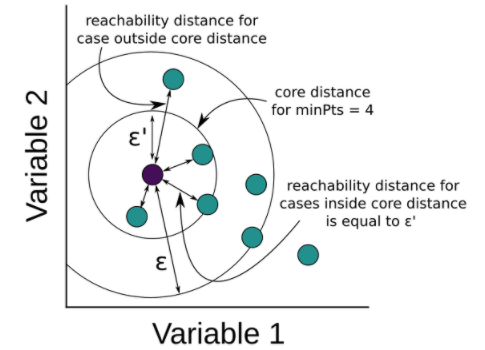
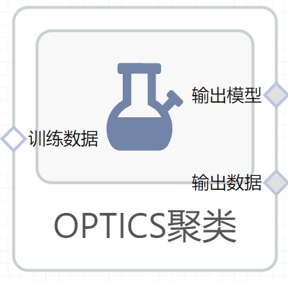

# OPTICS聚类使用文档
| 组件名称 |OPTICS聚类|  |  |
| --- | --- | --- | --- |
| 工具集 | 机器学习 |  |  |
| 组件作者 | 雪浪云-墨文 |  |  |
| 文档版本 | 1.0 |  |  |
| 功能 |OPTICS聚类算法|  |  |
| 镜像名称 | ml_components:3 |  |  |
| 开发语言 | Python |  |  |

## 组件原理
DBSCAN算法对于邻域半径eps和最小样本数minPoints这两个参数比较敏感，不同的参数取值会产生不同的聚类效果。为了降低参数设置对聚类结果造成的不稳定性，在DBSCAN算法的基础上，提出了OPTICS算法，全称如下

Ordering Points to identify the clustering structure

通过对样本点排序来识别聚类结构，为了搞清楚该算法，首先要理解以下两个基本概念

1. core distance，核心距离是使一个样本点成为core points的最小半径，在给定邻域半径eps和minPoints参数的前提下，核心距离可以比给定的eps更小

2. reachability distance，可达距离指的是样本与core point的距离

上述两种距离的定义可以参考下图来理解

可达距离则用于对样本点进行排序，这也是OPTICS算法中Ordering Points的由来。该算法的具体过程如下

1. 定义两个队列，有序队列和结果队列，有序队列用于存储core points及其密度直达points, 并按照可达距离升序排列；结果队列用于存储样本点的输出次序；有序队列中的points为待处理样本，结果队列中的points为处理之后的样本；

2. 选取一个未处理的core point, 将其放入结果队列，同时计算邻域内样本点的可达距离，按照可达距离升序将样本点依次放入有序队列；

3. 从有序队列中提取第一个样本，如果为core point, 则计算可达距离，将可达距离最小的点放入结果队列，如果不是core point, 则跳过该点，选取新的core point, 重复步骤2

4. 不断迭代第二步和第三步，直到所有样本点都处理完毕，然后输出结果队列中的样本点及其可达距离

处理完毕之后，根据样本的输出顺序和可达距离，可以绘制如下所示的柱状图，其中不同的峰谷对应不同不同的cluster， 红色表示噪声点

## 输入桩
支持单个csv文件输入。
### 输入端子1

- **端口名称**：训练数据
- **输入类型**：Csv文件
- **功能描述**： 输入用于训练的数据
## 输出桩
支持sklearn模型输出。
### 输出端子1

- **端口名称**：输出模型
- **输出类型**：sklearn模型
- **功能描述**： 输出训练好的模型用于预测
### 输出端子2

- **端口名称**：输出数据
- **输出类型**：Csv文件
- **功能描述**： 聚类后的数据
## 参数配置
### 最小样本数

- **功能描述**：一个数据点要做为中心点，所需的最小的近邻点数量
- **必选参数**：是
- **默认值**：5
### 最大距离（max_eps）

- **功能描述**：两个数据点能够被认定为邻居的最大距离
- **必选参数**：是
- **默认值**：5
### 计算距离方法

- **功能描述**：计算距离方法
- **必选参数**：是
- **默认值**：minkowski
### p

- **功能描述**：Minkowski距离计算方法参数
- **必选参数**：是
- **默认值**：2
### 聚类方法

- **功能描述**：聚类方法
- **必选参数**：是
- **默认值**：xi
### 最大距离（eps）

- **功能描述**：两个数据点能够被认定为邻居的最大距离，默认与max_eps相同，仅当聚类方法为"dbscan"时使用
- **必选参数**：否
- **默认值**：（无）
### xi

- **功能描述**：确定构成聚类边界的决策图上的最小陡度
- **必选参数**：是
- **默认值**：0.05
### 前置纠正

- **功能描述**：根据前置任务纠正集群
- **必选参数**：是
- **默认值**：false
### 簇中的最小样本数

- **功能描述**：簇中的最小样本数，表示为绝对数量或样本数一部分比例
- **必选参数**：是
- **默认值**：0.01
### 计算最近邻的算法

- **功能描述**：计算最近邻的算法
- **必选参数**：是
- **默认值**：auto
### 叶节点数量

- **功能描述**：Ball树以及KD树使用的参数
- **必选参数**：是
- **默认值**：30
### 并行度

- **功能描述**：计算时的并行任务数
- **必选参数**：否
- **默认值**：（无）
### 需要训练

- **功能描述**：该模型是否需要训练，默认为需要训练。
- **必选参数**：是
- **默认值**：true
### 特征字段

- **功能描述**：特征字段
- **必选参数**：是
- **默认值**：（无）
### 识别字段

- **功能描述**：识别字段
- **必选参数**：是
- **默认值**：（无）
## 使用方法
- 将组件拖入到项目中
- 与前一个组件输出的端口连接（必须是csv类型）
- 点击运行该节点

