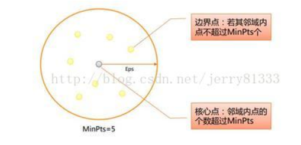
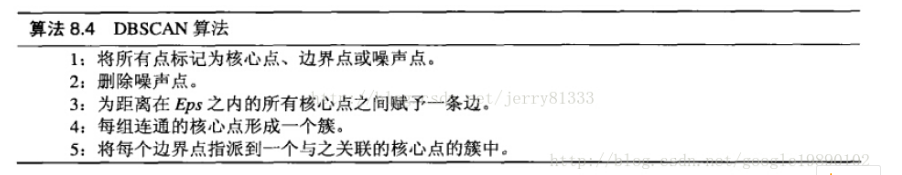

# 具有噪声的基于密度的聚类（DBSCAN）使用文档
| 组件名称 |具有噪声的基于密度的聚类（DBSCAN）|  |  |
| --- | --- | --- | --- |
| 工具集 | 机器学习 |  |  |
| 组件作者 | 雪浪云-墨文 |  |  |
| 文档版本 | 1.0 |  |  |
| 功能 |具有噪声的基于密度的聚类（DBSCAN）算法|  |  |
| 镜像名称 | ml_components:3 |  |  |
| 开发语言 | Python |  |  |

## 组件原理
DBSCAN(Density-Based Spatial Clustering of Applications with Noise，具有噪声的基于密度的聚类方法)是一种很典型的密度聚类算法。

所需参数： 半径：Eps Eps半径内指定的数目（阈值）：MinPts

数据点分为三： 

1. 核心点：在半径Eps内含有超过MinPts数目的点

2. 边界点：在半径Eps内点的数量小于MinPts，但是落在核心点的邻域内

3. 噪音点：既不是核心点也不是边界点的点

概念： 1. Eps领域：半径Eps之内所有点的合集 2. 直接密度可达（密度直达）：核心点X1对Eps领域内的任意点都是直接密度可达 3. 密度可达：设数据点点序列p(1)，p(2)，p(3)，…，p(n)，其中p(1)是核心对象，p(2)是从p(1)出发直接密度可达，p(n)从p(1)出发是密度可达的

## 输入桩
支持单个csv文件输入。
### 输入端子1

- **端口名称**：训练数据
- **输入类型**：Csv文件
- **功能描述**： 输入用于训练的数据
## 输出桩
支持sklearn模型输出。
### 输出端子1

- **端口名称**：输出模型
- **输出类型**：sklearn模型
- **功能描述**： 输出训练好的模型用于预测
### 输出端子2

- **端口名称**：输出数据
- **输出类型**：Csv文件
- **功能描述**： 聚类后的数据
## 参数配置
### 最大距离

- **功能描述**：一个样本与另一个样本相邻的两个样本之间的最大距离
- **必选参数**：是
- **默认值**：0.5
### 最小样本数

- **功能描述**：一个点的邻域内被视为核心点的样本数(或总权重)
- **必选参数**：是
- **默认值**：5
### 计算距离的方法

- **功能描述**：计算距离的方法
- **必选参数**：是
- **默认值**：euclidean
### 计算算法

- **功能描述**：计算逐点距离并找到最近的邻居的算法
- **必选参数**：是
- **默认值**：auto
### 叶节点数量

- **功能描述**：叶节点数量
- **必选参数**：是
- **默认值**：30
### p

- **功能描述**：Minkowski方法的参数
- **必选参数**：是
- **默认值**：2
### 并行度

- **功能描述**：计算时并行任务数
- **必选参数**：否
- **默认值**：（无）
### 需要训练

- **功能描述**：该模型是否需要训练，默认为需要训练。
- **必选参数**：是
- **默认值**：true
### 特征字段

- **功能描述**：特征字段
- **必选参数**：是
- **默认值**：（无）
### 识别字段

- **功能描述**：识别字段
- **必选参数**：是
- **默认值**：（无）
## 使用方法
- 将组件拖入到项目中
- 与前一个组件输出的端口连接（必须是csv类型）
- 点击运行该节点

