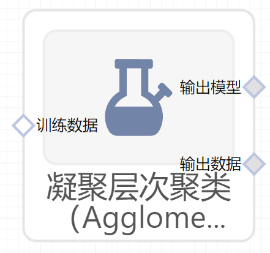

# 凝聚层次聚类（AgglomerativeClustering）使用文档
| 组件名称 |凝聚层次聚类（AgglomerativeClustering）|  |  |
| --- | --- | --- | --- |
| 工具集 | 机器学习 |  |  |
| 组件作者 | 雪浪云-墨文 |  |  |
| 文档版本 | 1.0 |  |  |
| 功能 | 凝聚层次聚类（AgglomerativeClustering）算法|  |  |
| 镜像名称 | ml_components:3 |  |  |
| 开发语言 | Python |  |  |

## 组件原理
平面聚类是高效且概念上简单的，但它有许多缺点。 算法返回平坦的非结构化簇集合，需要预先指定的簇数目作为输入并且这个数目是不确定的。 分层聚类（或分层聚类）输出层次结构，这种结构比平面聚类返回的非结构化聚类集更具信息性。 分层聚类不需要我们预先指定聚类的数量，并且在IR(Information Retrieval)中使用的大多数分层算法是确定性的。 分层聚类的这些优点以降低效率为代价。 与K-means和EM的线性复杂度相比，最常见的层次聚类算法具有至少二次的文档数量的复杂性。

平面和层次聚类在信息检索中的应用差异很小。 特别是，分层聚类适用于该文章中Table1中所示的任何应用程序。 实际上，我们为collection clustering提供的示例是分层的。 一般来说，当考虑聚类效率时，我们选择平面聚类，当平面聚类的潜在问题（不够结构化，预定数量的聚类，非确定性）成为关注点时，我们选择层次聚类。 此外，许多研究人员认为，层次聚类比平面聚类产生更好的聚类。 

分层聚类算法可以是自上而下的，也可以是自下而上的。 自下而上算法在开始时将每个文档视为单个簇，然后连续地合并（或聚合）簇对，直到所有簇已合并到包含所有文档的单个簇中。 因此，自下而上的层次聚类称为凝聚分层聚类或HAC。在介绍HAC中使用的特定相似性度量之前，我们首先介绍一种以图形方式描述层次聚类的方法，讨论HAC的一些关键属性，并提出一种计算HAC的简单算法。

HAC聚类通常可视化为树状图(Dendrogram)， 每个合并由水平线表示。 水平线的y坐标是合并的两个聚类的相似度（cosine similarity: 1为完全相似，0为完全不一样），其中文档被视为单个聚类。 我们将这种相似性称为合并簇的组合相似性(combination similarity)。

## 输入桩
支持单个csv文件输入。
### 输入端子1

- **端口名称**：训练数据
- **输入类型**：Csv文件
- **功能描述**： 输入用于训练的数据
## 输出桩
支持sklearn模型输出。
### 输出端子1

- **端口名称**：输出模型
- **输出类型**：sklearn模型
- **功能描述**： 输出训练好的模型用于预测
### 输出端子2

- **端口名称**：输出数据
- **输出类型**：Csv文件
- **功能描述**： 聚类后的数据
## 参数配置
### 类别数目

- **功能描述**：需要找到的类别的数目
- **必选参数**：是
- **默认值**：2
### 链接度量

- **功能描述**：用于计算链接的度量
- **必选参数**：是
- **默认值**：euclidean
### 计算完整的树

- **功能描述**：在n_clusters时提前停止树的构建
- **必选参数**：否
- **默认值**：（无）
### 链接标准

- **功能描述**：链接标准
- **必选参数**：是
- **默认值**：ward
### 距离阈值

- **功能描述**：链接距离阈值
- **必选参数**：是
- **默认值**：（无）
### 需要训练

- **功能描述**：该模型是否需要训练，默认为需要训练。
- **必选参数**：是
- **默认值**：true
### 特征字段

- **功能描述**：特征字段
- **必选参数**：是
- **默认值**：（无）
### 识别字段

- **功能描述**：识别字段
- **必选参数**：是
- **默认值**：（无）
## 使用方法
- 将组件拖入到项目中
- 与前一个组件输出的端口连接（必须是csv类型）
- 点击运行该节点

