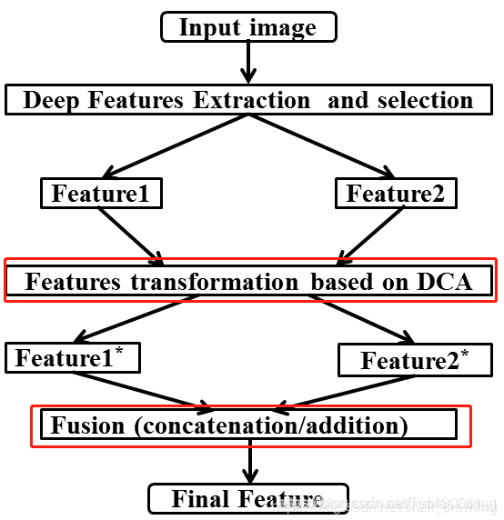
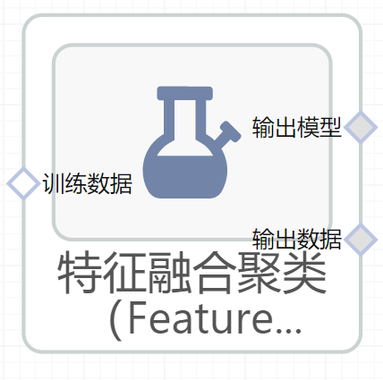

# 特征融合聚类（FeatureAgglomeration）使用文档
| 组件名称 |特征融合聚类（FeatureAgglomeration）|  |  |
| --- | --- | --- | --- |
| 工具集 | 机器学习 |  |  |
| 组件作者 | 雪浪云-墨文 |  |  |
| 文档版本 | 1.0 |  |  |
| 功能 |特征融合聚类（FeatureAgglomeration）算法|  |  |
| 镜像名称 | ml_components:3 |  |  |
| 开发语言 | Python |  |  |

## 组件原理
在很多工作中，融合不同尺度的特征是提高分割性能的一个重要手段。低层特征分辨率更高，包含更多位置、细节信息，但是由于经过的卷积更少，其语义性更低，噪声更多。高层特征具有更强的语义信息，但是分辨率很低，对细节的感知能力较差。如何将两者高效融合，取其长处，弃之糟泊，是改善分割模型的关键。
很多工作通过融合多层来提升检测和分割的性能，按照融合与预测的先后顺序，分类为早融合(Early fusion)和晚融合(Late fusion)。

早融合(Early fusion)： 先融合多层的特征，然后在融合后的特征上训练预测器（只在完全融合之后，才统一进行检测）。这类方法也被称为skip connection，即采用concat、add操作。这一思路的代表是Inside-Outside Net(ION)和HyperNet。 两个经典的特征融合方法：

-（1）concat：系列特征融合，直接将两个特征进行连接。两个输入特征x和y的维数若为p和q，输出特征z的维数为p+q；

-（2）add：并行策略，将这两个特征向量组合成复向量，对于输入特征x和y，z = x + iy，其中i是虚数单位。

晚融合(Late fusion)：通过结合不同层的检测结果改进检测性能（尚未完成最终的融合之前，在部分融合的层上就开始进行检测，会有多层的检测，最终将多个检测结果进行融合）。这一类研究思路的代表有两种：

-（1）feature不融合，多尺度的feture分别进行预测，然后对预测结果进行综合，如Single Shot MultiBox Detector (SSD) , Multi-scale CNN(MS-CNN)

-（2）feature进行金字塔融合，融合后进行预测，如Feature Pyramid Network(FPN)等。

## 输入桩
支持单个csv文件输入。
### 输入端子1

- **端口名称**：训练数据
- **输入类型**：Csv文件
- **功能描述**： 输入用于训练的数据
## 输出桩
支持sklearn模型输出。
### 输出端子1

- **端口名称**：输出模型
- **输出类型**：sklearn模型
- **功能描述**： 输出训练好的模型用于预测
### 输出端子2

- **端口名称**：输出数据
- **输出类型**：Csv文件
- **功能描述**： 聚类后的数据
## 参数配置
### 类别数目

- **功能描述**：要形成的簇的数量
- **必选参数**：是
- **默认值**：2
### 相似性计算方式

- **功能描述**：相似性计算方式
- **必选参数**：是
- **默认值**：euclidean
### 计算整棵树

- **功能描述**：当聚类类别达到设定值时，停止对数的构建
- **必选参数**：否
- **默认值**：（无）
### 链接标准

- **功能描述**：链接标准
- **必选参数**：是
- **默认值**：ward
### 距离阈值

- **功能描述**：链接距离阈值，超过此阈值，类簇不会被合并
- **必选参数**：是
- **默认值**：1
### 需要训练

- **功能描述**：该模型是否需要训练，默认为需要训练。
- **必选参数**：是
- **默认值**：true
### 特征字段

- **功能描述**：特征字段
- **必选参数**：是
- **默认值**：（无）
### 识别字段

- **功能描述**：识别字段
- **必选参数**：是
- **默认值**：（无）
## 使用方法
- 将组件拖入到项目中
- 与前一个组件输出的端口连接（必须是csv类型）
- 点击运行该节点

