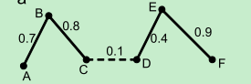
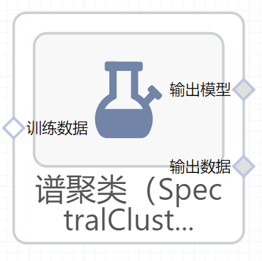

# 谱聚类（SpectralClustering）使用文档
| 组件名称 |谱聚类（SpectralClustering）|  |  |
| --- | --- | --- | --- |
| 工具集 | 机器学习 |  |  |
| 组件作者 | 雪浪云-墨文 |  |  |
| 文档版本 | 1.0 |  |  |
| 功能 |谱聚类（SpectralClustering）算法|  |  |
| 镜像名称 | ml_components:3 |  |  |
| 开发语言 | Python |  |  |

## 组件原理
谱聚类是从图论中演化出来的算法，后来在聚类中得到了广泛的应用。它的主要思想是把所有的数据看做空间中的点，这些点之间可以用边连接起来。距离较远的两个点之间的边权重值较低，而距离较近的两个点之间的边权重值较高，通过对所有数据点组成的图进行切图，让切图后不同的子图间边权重和尽可能的低，而子图内的边权重和尽可能的高，从而达到聚类的目的。

聚类的直观解释是根据样本间相似度，将它们分成不同组。谱聚类的思想是将样本看作顶点，样本间的相似度看作带权的边，从而将聚类问题转为图分割问题：找到一种图分割的方法使得连接不同组的边的权重尽可能低（这意味着组间相似度要尽可能低），组内的边的权重尽可能高（这意味着组内相似度要尽可能高）。将上面的例子代入就是将每一个博客当作图上的一个顶点，然后根据相似度将这些顶点连起来，最后进行分割。分割后还连在一起的顶点就是同一类了。更具体的例子如下图所示：

在上图中，一共有6个顶点（博客），顶点之间的连线表示两个顶点的相似度，现在要将这图分成两半（两个类），要怎样分割（去掉哪边条）？根据谱聚类的思想，应该去掉的边是用虚线表示的那条。最后，剩下的两半就分别对应两个类了。

根据这个思想，可以得到unnormalized谱聚类和normalized谱聚类，由于前者比后者简单，所以本文介绍unnormalized谱聚类的几个步骤（假设要分K个类）：

(a)建立similarity graph，并用 W 表示similarity graph的带权邻接矩阵

(b)计算unnormalized graph Laplacian matrix L(L = D - W, 其中D是degree matrix)

(c)计算L的前K个最小的特征向量

(d)把这k个特征向量排列在一起组成一个N*k的矩阵，将其中每一行看作k维空间中的一个向量，并使用 K-means 算法进行聚类

 
## 输入桩
支持单个csv文件输入。
### 输入端子1

- **端口名称**：训练数据
- **输入类型**：Csv文件
- **功能描述**： 输入用于训练的数据
## 输出桩
支持sklearn模型输出。
### 输出端子1

- **端口名称**：输出模型
- **输出类型**：sklearn模型
- **功能描述**： 输出训练好的模型用于预测
### 输出端子2

- **端口名称**：输出数据
- **输出类型**：Csv文件
- **功能描述**： 聚类后的数据
## 参数配置
### 投影子空间的维数

- **功能描述**：投影子空间的维数
- **必选参数**：是
- **默认值**：8
### 特征值分解策略

- **功能描述**：特征值分解策略
- **必选参数**：是
- **默认值**：amg
### 特征向量数

- **功能描述**：用于频谱嵌入的特征向量的数量
- **必选参数**：是
- **默认值**：2
### Random State

- **功能描述**：随机种子
- **必选参数**：否
- **默认值**：（无）
### KMeans算法运行次数

- **功能描述**：使用不同质心种子运行KMeans算法的次数
- **必选参数**：是
- **默认值**：10
### 核系数

- **功能描述**：核系数
- **必选参数**：是
- **默认值**：1
### 相似度矩阵构造方法

- **功能描述**：相似度矩阵构造方法
- **必选参数**：是
- **默认值**：rbf
### 近邻数

- **功能描述**：构建相似性矩阵时使用的临近数据点数量
- **必选参数**：是
- **默认值**：10
### 停止准则

- **功能描述**：当特征值分解策略为"arpack"时的特征分解的停止准则
- **必选参数**：是
- **默认值**：0
### 分配标签的策略

- **功能描述**：用于在嵌入空间中分配标签的策略
- **必选参数**：是
- **默认值**：kmeans
### degree

- **功能描述**：度
- **必选参数**：是
- **默认值**：3
### coef0

- **功能描述**：截距项
- **必选参数**：是
- **默认值**：1
### 并行度

- **功能描述**：计算的并行度
- **必选参数**：否
- **默认值**：（无）
### 需要训练

- **功能描述**：该模型是否需要训练，默认为需要训练。
- **必选参数**：是
- **默认值**：true
### 特征字段

- **功能描述**：特征字段
- **必选参数**：是
- **默认值**：（无）
### 识别字段

- **功能描述**：识别字段
- **必选参数**：是
- **默认值**：（无）
## 使用方法
- 将组件拖入到项目中
- 与前一个组件输出的端口连接（必须是csv类型）
- 点击运行该节点

