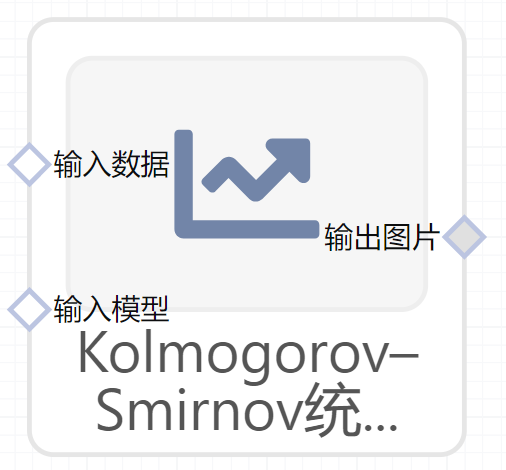

# Kolmogorov-Smirnov统计图（KS Statistics）使用文档
| 组件名称 |Kolmogorov-Smirnov统计图（KS Statistics）|  |  |
| --- | --- | --- | --- |
| 工具集 | 机器学习 |  |  |
| 组件作者 | 雪浪云-墨文 |  |  |
| 文档版本 | 1.0 |  |  |
| 功能 |Kolmogorov-Smirnov统计图（KS Statistics）|  |  |
| 镜像名称 | ml_components:3 |  |  |
| 开发语言 | Python |  |  |

## 组件原理
KS(Kolmogorov-Smirnov)：KS用于模型风险区分能力进行评估， 指标衡量的是好坏样本累计分部之间的差值。 好坏样本累计差异越大，KS指标越大，那么模型的风险区分能力越强。

KS的计算步骤如下： 

- 计算每个评分区间的好坏账户数。 
- 计算每个评分区间的累计好账户数(注意是累计，也就是包含前面的区间)占总好账户数比率(good%)和累计坏账户数占总坏账户数比率(bad%)。 
- 计算每个评分区间累计坏账户占比与累计好账户占比差的绝对值（累计good%-累计bad%），然后对这些绝对值取最大值即得此评分卡的K-S值。
## 输入桩
支持Csv、sklearn文件输入。
### 输入端子1

- **端口名称**：输入数据
- **输入类型**：Csv文件
- **功能描述**：输入预测后的数据
### 输入端子2

- **端口名称**：输入模型
- **输入类型**：sklearn文件
- **功能描述**：输入预测后的模型

## 输出桩
支持image文件输出。
### 输出端子1

- **端口名称**：输出图片
- **输出类型**：image文件 
- **功能描述**：输出Kolmogorov-Smirnov统计图

## 参数配置
### 标题

- **功能描述**：图片的标题
- **必选参数**：是
- **默认值**：（无）
### 特征字段

- **功能描述**：特征字段
- **必选参数**：是
- **默认值**：（无）
### 标识字段

- **功能描述**：标识字段
- **必选参数**：是
- **默认值**：（无）

## 使用方法
- 将组件拖入到项目中
- 与前一个组件输出的端口连接（必须是csv类型）
- 点击运行该节点

