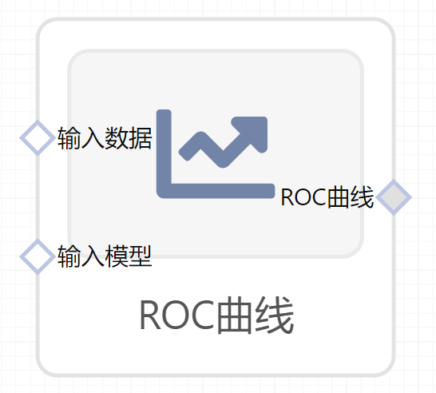

# ROC曲线使用文档
| 组件名称 |ROC曲线|  |  |
| --- | --- | --- | --- |
| 工具集 | 机器学习 |  |  |
| 组件作者 | 雪浪云-墨文 |  |  |
| 文档版本 | 1.0 |  |  |
| 功能 |ROC曲线|  |  |
| 镜像名称 | ml_components:3 |  |  |
| 开发语言 | Python |  |  |

## 组件原理
接受者操作特性曲线（receiver operating characteristic curve，简称ROC曲线），又称为感受性曲线（sensitivity curve）。得此名的原因在于曲线上各点反映着相同的感受性，它们都是对同一信号刺激的反应，只不过是在几种不同的判定标准下所得的结果而已。接受者操作特性曲线就是以虚惊概率为横轴，击中概率为纵轴所组成的坐标图，和被试在特定刺激条件下由于采用不同的判断标准得出的不同结果画出的曲线。

举例来讲，对于一个二分问题，可将实例（case）分成正类（positive）或负类（negative）。如果进行预测，会出现四种情况，即：实例是正类并且也被预测成正类，即为真正类TP（True positive）,实例是负类被预测成正类，称之为假正类FP（False positive）,实例是负类被预测成负类，称之为真负类TN（True negative）,实例是正类被预测成负类，称之为假负类FN（false negative）。

## 输入桩
支持csv文件输入。
### 输入端子1

- **端口名称**：输入数据
- **输入类型**：Csv文件
- **功能描述**：输入预测后的数据
### 输入端子2

- **端口名称**：输入模型
- **输入类型**：sklearn文件
- **功能描述**：输入预测后的模型
## 输出桩
支持image文件输出。
### 输出端子1

- **端口名称**：ROC曲线
- **输出类型**：image文件 
- **功能描述**：输出图像

## 参数配置
### 标题

- **功能描述**：图像的标题
- **必选参数**：是
- **默认值**：（无）
### 画micro平均的曲线

- **功能描述**：是否画micro平均的曲线
- **必选参数**：是
- **默认值**：true
### 特征字段

- **功能描述**：特征字段
- **必选参数**：是
- **默认值**：（无）
### 标签字段

- **功能描述**：标签字段
- **必选参数**：是
- **默认值**：（无）

## 使用方法
- 将组件拖入到项目中
- 与前一个组件输出的端口连接（必须是csv类型）
- 点击运行该节点

