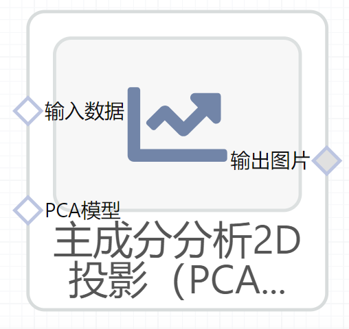

# 主成分分析2D投影（PCA 2D Projection）使用文档
| 组件名称 |主成分分析2D投影（PCA 2D Projection）|  |  |
| --- | --- | --- | --- |
| 工具集 | 机器学习 |  |  |
| 组件作者 | 雪浪云-墨文 |  |  |
| 文档版本 | 1.0 |  |  |
| 功能 |主成分分析2D投影（PCA 2D Projection）|  |  |
| 镜像名称 | ml_components:3 |  |  |
| 开发语言 | Python |  |  |

## 组件原理
PCA(Principal Components Analysis)，它是一种“投影(projection)技巧”，就是把高维空间上的数据映射到低维空间。比如三维空间的一个球，往坐标轴方向投影，变成了一个圆。球是3维的，圆是2维的。在球变成圆的这个投影过程中，丢失了原来物体(球)的一部分“性质”---圆不是球了，只有面积没有体积了；也保留了原来物体的一部分性质。

而对于一个训练样本y而言，假设它有M个特征(M维)，y={y1, y2,...yM}，通过PCA，进行投影，降维成D维(M>D)。

PCA降维的目标就是：找到一种投影方式，将原来的M维样本y 变成 D维样本x，并且使得投影之后的D维样本x，能够尽可能多地保存原来的样本y中的信息。
## 输入桩
支持Csv文件输入。
### 输入端子1

- **端口名称**：输入数据
- **输入类型**：Csv文件
- **功能描述**：输入预测后的数据
### 输入端子2

- **端口名称**：PCA模型
- **输入类型**：sklearn文件
- **功能描述**：输入PCA模型
## 输出桩
支持image文件输出。
### 输出端子1

- **端口名称**：输出图片
- **输出类型**：image文件 
- **功能描述**：输出主成分分析2D投影图

## 参数配置
### 标题

- **功能描述**：图像的标题
- **必选参数**：是
- **默认值**：（无）
### 显示biplot

- **功能描述**：是否显示biplot
- **必选参数**：是
- **默认值**：true
### 特征字段

- **功能描述**：特征字段
- **必选参数**：是
- **默认值**：（无）
### 标签列

- **功能描述**：标签列
- **必选参数**：是
- **默认值**：（无）

## 使用方法
- 将组件拖入到项目中
- 与前一个组件输出的端口连接（必须是csv类型）
- 点击运行该节点

