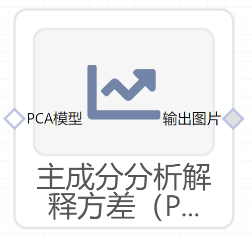

# 主成分分析解释方差（PCAExplainedVariance）使用文档
| 组件名称 |主成分分析解释方差（PCAExplainedVariance）|  |  |
| --- | --- | --- | --- |
| 工具集 | 机器学习 |  |  |
| 组件作者 | 雪浪云-墨文 |  |  |
| 文档版本 | 1.0 |  |  |
| 功能 |主成分分析解释方差（PCAExplainedVariance）|  |  |
| 镜像名称 | ml_components:3 |  |  |
| 开发语言 | Python |  |  |

## 组件原理
PCA（Principal Component Analysis） 是一种常见的数据分析方式，常用于高维数据的降维，可用于提取数据的主要特征分量。PCA通常用于降低大型数据集的维数，方法是数据集中的指标数量变少，并且保留原数据集中指标的大部分信息。总而言之：减少数据指标数量，保留尽可能多的信息

通过计算协方差矩阵的特征向量和特征值来确定数据的主成分。主成分定义：主成分是由初始变量的线性组合或混合构成的新变量。新变量是互不相关的，并且初始变量中的大部分信息被挤压或压缩到第一成分中。通俗来讲，十维数据给十个主成分，PCA试图将最大可能信息放在第一个组件中，然后第二组件中放置最大的剩余信息.

## 输入桩
支持sklearn文件输入。
### 输入端子1

- **端口名称**：PCA模型
- **输入类型**：sklearn文件
- **功能描述**：输入PCA模型
## 输出桩
支持image文件输出。
### 输出端子1

- **端口名称**：输出图片
- **输出类型**：image文件 
- **功能描述**：输出主成分分析解释方差图

## 参数配置
### 标题

- **功能描述**：图像的标题
- **必选参数**：是
- **默认值**：（无）
### 目标解释方差

- **功能描述**：目标解释方差
- **必选参数**：是
- **默认值**：0.75
### 特征字段

- **功能描述**：特征字段
- **必选参数**：是
- **默认值**：（无）

## 使用方法
- 将组件拖入到项目中
- 与前一个组件输出的端口连接（必须是csv类型）
- 点击运行该节点

