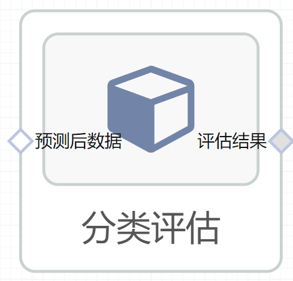

#分类评估使用文档
| 组件名称 |分类评估|  |  |
| --- | --- | --- | --- |
| 工具集 | 机器学习 |  |  |
| 组件作者 | 雪浪云-墨文 |  |  |
| 文档版本 | 1.0 |  |  |
| 功能 |分类评估算法|  |  |
| 镜像名称 | ml_components:3 |  |  |
| 开发语言 | Python |  |  |

## 组件原理
现实任务中往往会对学习器的泛化性能、时间开销、存储开销、可解释性等方面的因素进行评估并作出选择。通常将包含m个样本的数据集D={(x1,y1),(x2,y2),...,(xm,ym)}拆分成训练集S和测试集T。

留出法：直接将数据集划分为两个互斥集合，训练/测试集划分要尽可能保持数据分布的一致性，一般若干次随机划分、重复实验取平均值。

交叉验证法：将数据集分层采样划分为k个大小相似的互斥子集，每次用k-1个子集的并集作为训练集，余下的子集作为测试集，最终返回k个测试结果的均值，k最常用的取值是10。

与留出法类似，将数据集D划分为k个子集同样存在多种划分方式，为了减小因样本划分不同而引入的差别，k折交叉验证通常随机使用不同的划分重复p次，最终的评估结果是这p次k折交叉验证结果的均值，例如常见的“10次10折交叉验证”。
## 输入桩
支持单个csv文件输入。
### 输入端子1

- **端口名称**：预测后数据
- **输入类型**：Csv文件
- **功能描述**： 输入预测后的数据
## 输出桩
支持json文件输出。
### 输出端子1

- **端口名称**：评估结果
- **输出类型**：json文件 
- **功能描述**： 输出评估的结果

## 参数配置
### 评估指标

- **功能描述**：选择分类评估的指标，有以下指标可以选择：f1_score、accuracy_score、precision_score、recall_score、hamming_loss、zero_one_loss、jaccard_score、balanced_accuracy_score、log_loss、sohen_kappa_score、matthews_corrcoef
- **必选参数**：是
- **默认值**：f1_score
### 标签列

- **功能描述**：标签列
- **必选参数**：是
- **默认值**：（无）
### 预测列

- **功能描述**：预测列
- **必选参数**：是
- **默认值**：（无）
## 使用方法
- 将组件拖入到项目中
- 与前一个组件输出的端口连接（必须是csv类型）
- 点击运行该节点

