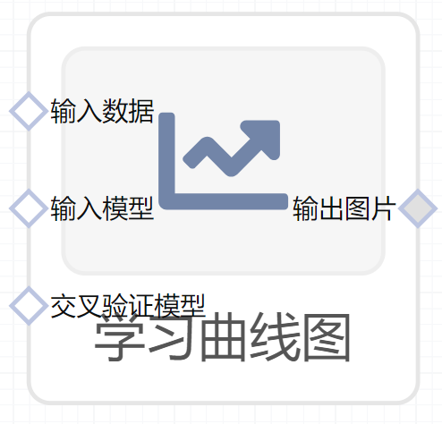

# 学习曲线图使用文档
| 组件名称 |学习曲线图|  |  |
| --- | --- | --- | --- |
| 工具集 | 机器学习 |  |  |
| 组件作者 | 雪浪云-墨文 |  |  |
| 文档版本 | 1.0 |  |  |
| 功能 |学习曲线图|  |  |
| 镜像名称 | ml_components:3 |  |  |
| 开发语言 | Python |  |  |

## 组件原理
学习曲线learning curve 以横轴表示反复次数（探索次数）。以纵轴表示各种学习测试的学习过程的曲线。作为学习测试，在用错误数、时间、反应潜时等情况下的负加速下降曲线，如果用正反应数或正反应率为纵坐标。则呈S型或负加速的上升曲线。然而这些曲线型。不仅表示学习效果的增减。而且根据测试的特性，多依赖于理论的界限、生理或行为的界限。另外，把直到学习成功所需的反复探索数并不相同的许多个体资料，简单地取反复探索次数的平均值来表示，则难以表示学习过程的特征，导致错误的结论。所以提出了将学习开始和完成时期划齐，即用各个体的横轴或伸或缩，将曲线加合起来的方法。这样得到的平均曲线称为奋森曲线（Vincent curve），但几乎无人使用，不过对从个体所得到的资料还是受重视的。

学习曲线也称为经验曲线，是随着产品累计产量的增加，单位产品的成本会以一定的比例下降。学习曲线(Learning curve)是表示单位产品生产时间与所生产的产品总数量之间的关系的一条曲线。

熟练工程，也称动态评价技术。他们对缩短工时进行动态评价的技术，广泛应用于生产领域中。

学习曲线将学习效果数量化绘制于坐标纸上，横轴代表练习次数（或产量），纵轴代表学习的效果（单位产品所耗时间），这样绘制出的一条曲线，就是学习曲线。

学习曲线有广义和狭义之分。狭义的学习曲线又称为人员学习曲线，它是指直接作业人员个人的学习曲线。广义的学习曲线也称为生产进步函数，是指工业某一行业或某一产品在其产品寿命周期的学习曲线，是融合技术进步、管理水平提高等许多人努力的学习曲线。

## 输入桩
支持Csv文件输入。
### 输入端子1

- **端口名称**：输入数据
- **输入类型**：Csv文件
- **功能描述**：输入预测后的数据
### 输入端子2

- **端口名称**：输入模型
- **输入类型**：sklearn文件
- **功能描述**：输入预测后的模型
### 输入端子3

- **端口名称**：交叉验证模型
- **输入类型**：sklearn文件
- **功能描述**：输入交叉验证的模型
## 输出桩
支持image文件输出。
### 输出端子1

- **端口名称**：输出图片
- **输出类型**：image文件 
- **功能描述**：输出学习曲线图

## 参数配置
### 标题

- **功能描述**：图像的标题
- **必选参数**：是
- **默认值**：（无）
### Shuffle

- **功能描述**：是否打乱
- **必选参数**：是
- **默认值**：false
### 任务并行数

- **功能描述**：任务并行数
- **必选参数**：是
- **默认值**：（无）
### 特征字段

- **功能描述**：特征字段
- **必选参数**：是
- **默认值**：（无）
### 标签字段

- **功能描述**：标签字段
- **必选参数**：是
- **默认值**：（无）

## 使用方法
- 将组件拖入到项目中
- 与前一个组件输出的端口连接（必须是csv类型）
- 点击运行该节点

