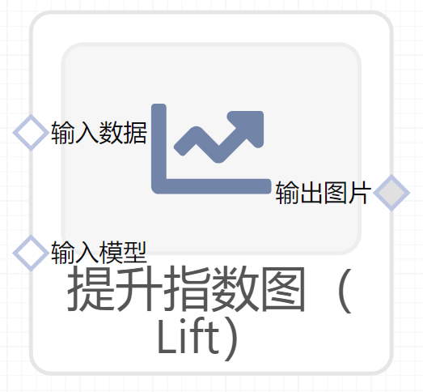

# 提升指数图（Lift）使用文档
| 组件名称 |提升指数图（Lift）|  |  |
| --- | --- | --- | --- |
| 工具集 | 机器学习 |  |  |
| 组件作者 | 雪浪云-墨文 |  |  |
| 文档版本 | 1.0 |  |  |
| 功能 |提升指数图（Lift）|  |  |
| 镜像名称 | ml_components:3 |  |  |
| 开发语言 | Python |  |  |

## 组件原理
Lift（提升指数）是评估一个预测模型是否有效的一个度量；这个比值由运用和不运用这个模型所得来的结果计算而来。

Lift图衡量的是，与不利用模型相比，模型的预测能力“变好”了多少，lift(提升指数)越大，模型的运行效果越好。
## 输入桩
支持csv文件输入。
### 输入端子1

- **端口名称**：输入数据
- **输入类型**：Csv文件
- **功能描述**：输入预测后的数据
### 输入端子2

- **端口名称**：输入模型
- **输入类型**：sklearn文件
- **功能描述**：输入预测后的模型
## 输出桩
支持image文件输出。
### 输出端子1

- **端口名称**：输出图片
- **输出类型**：image文件 
- **功能描述**：输出提升指数图（Lift）

## 参数配置
### 标题

- **功能描述**：图像的标题
- **必选参数**：是
- **默认值**：（无）
### 特征字段

- **功能描述**：特征字段
- **必选参数**：是
- **默认值**：（无）
### 标签字段

- **功能描述**：标签字段
- **必选参数**：是
- **默认值**：（无）

## 使用方法
- 将组件拖入到项目中
- 与前一个组件输出的端口连接（必须是csv类型）
- 点击运行该节点

