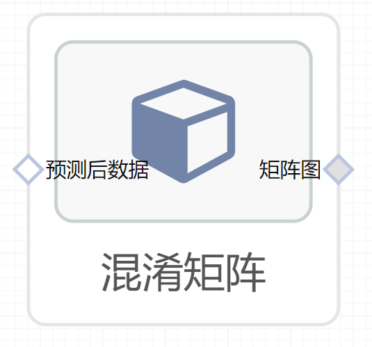

# 混淆矩阵使用文档
| 组件名称 |混淆矩阵|  |  |
| --- | --- | --- | --- |
| 工具集 | 机器学习 |  |  |
| 组件作者 | 雪浪云-墨文 |  |  |
| 文档版本 | 1.0 |  |  |
| 功能 |混淆矩阵|  |  |
| 镜像名称 | ml_components:3 |  |  |
| 开发语言 | Python |  |  |

## 组件原理
混淆矩阵也称误差矩阵，是表示精度评价的一种标准格式，用n行n列的矩阵形式来表示。具体评价指标有总体精度、制图精度、用户精度等，这些精度指标从不同的侧面反映了图像分类的精度。在人工智能中，混淆矩阵（confusion matrix）是可视化工具，特别用于监督学习，在无监督学习一般叫做匹配矩阵。在图像精度评价中，主要用于比较分类结果和实际测得值，可以把分类结果的精度显示在一个混淆矩阵里面。混淆矩阵是通过将每个实测像元的位置和分类与分类图像中的相应位置和分类相比较计算的。

混淆矩阵的每一列代表了预测类别，每一列的总数表示预测为该类别的数据的数目；每一行代表了数据的真实归属类别，每一行的数据总数表示该类别的数据实例的数目。每一列中的数值表示真实数据被预测为该类的数目：第一行第一列中的43表示有43个实际归属第一类的实例被预测为第一类，同理，第一行第二列的2表示有2个实际归属为第一类的实例被错误预测为第二类。
## 输入桩
支持单个csv文件输入。
### 输入端子1

- **端口名称**：预测后数据
- **输入类型**：Csv文件
- **功能描述**：输入预测后的数据
## 输出桩
支持image文件输出。
### 输出端子1

- **端口名称**：矩阵图
- **输出类型**：image文件 
- **功能描述**：输出图像

## 参数配置
### title

- **功能描述**：图像的标题
- **必选参数**：是
- **默认值**：（无）
### normalize

- **功能描述**：是否归一化
- **必选参数**：是
- **默认值**：false
### classes

- **功能描述**：类的数目
- **必选参数**：是
- **默认值**：（无）
### 标签字段

- **功能描述**：标签字段
- **必选参数**：是
- **默认值**：（无）
### 预测字段

- **功能描述**：预测字段
- **必选参数**：是
- **默认值**：（无）
## 使用方法
- 将组件拖入到项目中
- 与前一个组件输出的端口连接（必须是csv类型）
- 点击运行该节点

