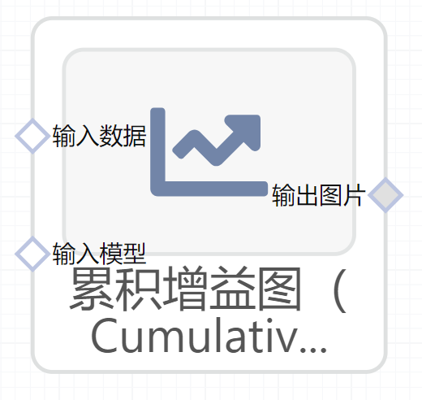

# 累计增益图（Cumulative Gain）使用文档
| 组件名称 |累计增益图（Cumulative Gain）|  |  |
| --- | --- | --- | --- |
| 工具集 | 机器学习 |  |  |
| 组件作者 | 雪浪云-墨文 |  |  |
| 文档版本 | 1.0 |  |  |
| 功能 |累计增益图（Cumulative Gain）|  |  |
| 镜像名称 | ml_components:3 |  |  |
| 开发语言 | Python |  |  |

## 组件原理
在评估模型的预测能力上，提升图 (lift chart)和增益图(gain chart)是一种非常有用的图形表达方式。

增益（Gain）表示列表中每一个item的相关性分数。累计增益（Cumulative Gain）表示对K个item的Gain进行累加。折损累计增益（Discounted Cumulative Gain）考虑排序顺序的因素，使得排名靠前的item增益更高，对排名靠后的item进行折损。

## 输入桩
支持Csv、sklearn文件输入。
### 输入端子1

- **端口名称**：训练数据
- **输入类型**：Csv文件
- **功能描述**：输入预测后的数据
### 输入端子2

- **端口名称**：输入模型
- **输入类型**：sklearn文件
- **功能描述**：输入预测后的模型

## 输出桩
支持image文件输出。
### 输出端子1

- **端口名称**：输出图片
- **输出类型**：image文件 
- **功能描述**：输出累计增益图

## 参数配置
### 标题

- **功能描述**：图片的标题
- **必选参数**：是
- **默认值**：（无）
### 特征字段

- **功能描述**：特征字段
- **必选参数**：是
- **默认值**：（无）
### 标识字段

- **功能描述**：标识字段
- **必选参数**：是
- **默认值**：（无）

## 使用方法
- 将组件拖入到项目中
- 与前一个组件输出的端口连接（必须是csv类型）
- 点击运行该节点

