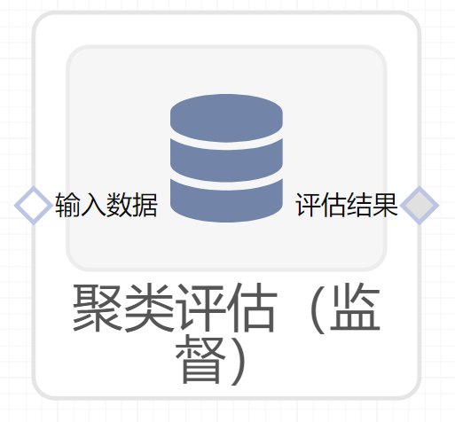

# 聚类评估（监督）使用文档
| 组件名称 |聚类评估（监督）|  |  |
| --- | --- | --- | --- |
| 工具集 | 机器学习 |  |  |
| 组件作者 | 雪浪云-墨文 |  |  |
| 文档版本 | 1.0 |  |  |
| 功能 |聚类评估（监督）算法|  |  |
| 镜像名称 | ml_components:3 |  |  |
| 开发语言 | Python |  |  |

## 组件原理
在聚类分析中引入关于数据的外部信息，通常来说是引入已知的数据对象的类标号形式，通过对比聚类分析的簇标号和类标号的对应程度来反映聚类技术的质量。由于我们在聚类分析之外就已知了对象的分类信息，因此这种评估主要还是针对聚类技术的性能测试，以表明聚类技术能够在何种程度上替代人工标注，而不是进行实际的聚类分析任务。

面向分类准确度的度量：主要评估预测的类标号与实际类标号的对应程度。这使得聚类算法的评估问题变成了一个分类器性能的评估问题，因此有度量：熵、纯度、精度、召回率、F度量等。

面向相似性的度量：聚类算法除了需要准确进行分类外，还应该尽可能使得簇内的对象的相似性尽可能高。聚类算法的本质也在于聚合相似性高的对象，而不是进行分类。这种度量基于这一个前提：同一个簇的两个对象同样应该属于一个类。

层次聚类的簇有效性评估：层次聚类的簇评估较为复杂，其主要评估层次聚类是否对于每个类，至少有一个簇相对较为纯粹，且能够包含该类的大部分对象。需要对每个类，计算簇层次结构内每个簇的F度量。
## 输入桩
支持单个csv文件输入。
### 输入端子1

- **端口名称**：输入数据
- **输入类型**：Csv文件
- **功能描述**：输入预测后的数据
## 输出桩
支持json文件输出。
### 输出端子1

- **端口名称**：评估结果
- **输出类型**：json文件 
- **功能描述**：输出评估的结果

## 参数配置
### 度量方法

- **功能描述**：选择聚类评估的指标，有以下指标可以选择：completeness_score、fowlkes_mallows_score、homogeneity_score、mutual_info_score、normalized_mutual_info_score
- **必选参数**：是
- **默认值**：completeness_score
### 标签字段

- **功能描述**：标签字段
- **必选参数**：是
- **默认值**：（无）
### 预测字段

- **功能描述**：预测字段
- **必选参数**：是
- **默认值**：（无）
## 使用方法
- 将组件拖入到项目中
- 与前一个组件输出的端口连接（必须是csv类型）
- 点击运行该节点

