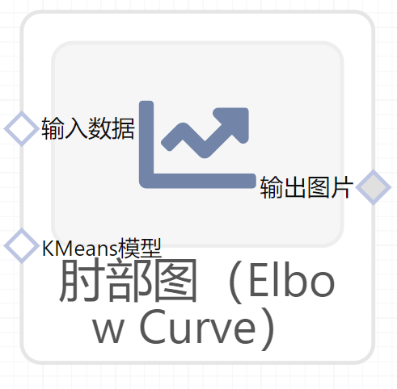

# 肘部图（Elbow Curve）使用文档
| 组件名称 |肘部图（Elbow Curve）|  |  |
| --- | --- | --- | --- |
| 工具集 | 机器学习 |  |  |
| 组件作者 | 雪浪云-墨文 |  |  |
| 文档版本 | 1.0 |  |  |
| 功能 |肘部图（Elbow Curve）|  |  |
| 镜像名称 | ml_components:3 |  |  |
| 开发语言 | Python |  |  |

## 组件原理
肘形判据：增加类别的数量，直到回报减少，然后停止。对于k-means来说就是先用2簇聚类，然后3簇聚类等等直至k簇。对于GMM来说是一样的思路。我们观察可释方差与类别个数的关系图，当图中肘部出现时，我们选择肘部出现时的类别个数。

随着K的增加，纵轴呈下降趋势且最终趋于稳定，那么拐点肘部处的位置所对应的k值，就是相对最佳的类聚数量值。
## 输入桩
支持Csv文件输入。
### 输入端子1

- **端口名称**：输入数据
- **输入类型**：Csv文件
- **功能描述**：输入预测后的数据
### 输入端子2

- **端口名称**：Kmeans模型
- **输入类型**：sklearn文件
- **功能描述**：输入Kmeans模型
## 输出桩
支持image文件输出。
### 输出端子1

- **端口名称**：输出图片
- **输出类型**：image文件 
- **功能描述**：输出肘部图

## 参数配置
### 标题

- **功能描述**：图像的标题
- **必选参数**：是
- **默认值**：（无）
### 聚类范围

- **功能描述**：聚类范围
- **必选参数**：是
- **默认值**：（无）
### 显示聚类时间

- **功能描述**：是否显示聚类时间
- **必选参数**：是
- **默认值**：true
### 特征字段

- **功能描述**：特征字段
- **必选参数**：是
- **默认值**：（无）

## 使用方法
- 将组件拖入到项目中
- 与前一个组件输出的端口连接（必须是csv类型）
- 点击运行该节点

