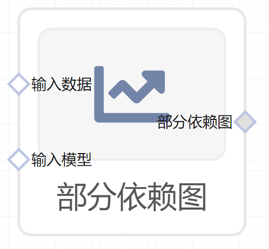

# 部分依赖图使用文档
| 组件名称 |部分依赖图|  |  |
| --- | --- | --- | --- |
| 工具集 | 机器学习 |  |  |
| 组件作者 | 雪浪云-墨文 |  |  |
| 文档版本 | 1.0 |  |  |
| 功能 |部分依赖图|  |  |
| 镜像名称 | ml_components:3 |  |  |
| 开发语言 | Python |  |  |

## 组件原理
部分依赖图（短 PDP 或 PD 图）显示了一个或两个特征对机器学习模型的预测结果的边际效应。 部分依赖图可以显示目标和特征之间的关系是线性的、单调的还是更复杂的。 例如，当应用于线性回归模型时，部分依赖图始终显示线性关系。

通常，集合 S 中只有一两个特征。 S 中的特征是我们想知道对预测的影响的特征。 特征向量xS 和XC组合起来构成总的特征空间x。 部分依赖通过在集合 C 中的特征分布上边缘化机器学习模型输出来工作，以便该函数显示我们感兴趣的集合 S 中的特征与预测结果之间的关系。 通过边缘化其他特征，我们得到一个仅依赖于 S 中的特征的函数，包括与其他特征的交互。
## 输入桩
支持csv文件输入。
### 输入端子1

- **端口名称**：输入数据
- **输入类型**：Csv文件
- **功能描述**：输入预测后的数据
### 输入端子2

- **端口名称**：输入模型
- **输入类型**：sklearn文件
- **功能描述**：输入预测后的模型
## 输出桩
支持image文件输出。
### 输出端子1

- **端口名称**：部分依赖图
- **输出类型**：image文件 
- **功能描述**：输出图像

## 参数配置
### Response Method

- **功能描述**：相应方法，有以下方法可以选择：auto、predict_proba、decision_function
- **必选参数**：是
- **默认值**：auto
### 最大列数

- **功能描述**：最大列数
- **必选参数**：是
- **默认值**：3
### 网格分辨率

- **功能描述**：网格分辨率
- **必选参数**：是
- **默认值**：100
### 百分位下限

- **功能描述**：百分位下限
- **必选参数**：是
- **默认值**：0.05
### 百分位上限

- **功能描述**：百分位上限
- **必选参数**：是
- **默认值**：0.95
### 部份依赖计算方法

- **功能描述**：部份依赖计算方法，有以下方法可以选择：auto、brute、recursion
- **必选参数**：是
- **默认值**：auto
### 并行任务数

- **功能描述**：并行任务数
- **必选参数**：否
- **默认值**：（无）
### 特征字段

- **功能描述**：特征字段
- **必选参数**：是
- **默认值**：（无）
## 使用方法
- 将组件拖入到项目中
- 与前一个组件输出的端口连接（必须是csv类型）
- 点击运行该节点

