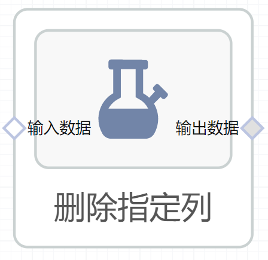

# 删除指定列使用文档
| 组件名称 |删除指定列|  |  |
| --- | --- | --- | --- |
| 工具集 | 机器学习 |  |  |
| 组件作者 | 雪浪云-墨文 |  |  |
| 文档版本 | 1.0 |  |  |
| 功能 |删除指定列 |  |  |
| 镜像名称 | ml_components:3 |  |  |
| 开发语言 | Python |  |  |

## 组件原理
删除指定列组件，用于删除数据中指定的列
## 输入桩
支持单个csv文件输入。
### 输入端子1

- **端口名称：** 输入数据
- **输出类型：** Csv文件
- **功能描述：** 输入需要删除列的文件

## 输出桩
支持Csv文件输出。
### 输出端子1

- **端口名称：** 输出数据
- **输出类型：** Csv文件
- **功能描述：** 输出处理后的文件

## 参数配置
### 需要删除的列

- **功能描述：** 需要删除的列
- **必选参数：** 是
- **默认值：** （无）

## 使用方法
- 加组件拖入到项目中
- 与前一个组件输出的端口连接（必须是csv类型）
- 点击运行该节点

