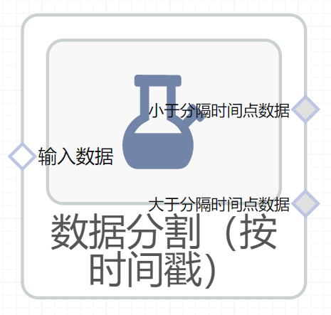

# 数据分割（按时间戳）使用文档
| 组件名称 |数据分割（按时间戳）|  |  |
| --- | --- | --- | --- |
| 工具集 | 机器学习 |  |  |
| 组件作者 | 雪浪云-墨文 |  |  |
| 文档版本 | 1.0 |  |  |
| 功能 |数据分割（按时间戳） |  |  |
| 镜像名称 | ml_components:3 |  |  |
| 开发语言 | Python |  |  |

## 组件原理
数据分割（按时间戳），用于按照时间戳分割数据集，小于指定时间戳的数据为一个输出；大于指定时间戳的数据另为一个输出
## 输入桩
支持单个csv文件输入。
### 输入端子1

- **端口名称：** 输入数据
- **输出类型：** Csv文件
- **功能描述：** 输入需要数据分割的文件

## 输出桩
支持Csv文件输出。
### 输出端子1

- **端口名称：** 小于分隔时间点数据
- **输出类型：** Csv文件
- **功能描述：** 输出小于分隔时间点数据
### 输出端子2

- **端口名称：** 大于分隔时间点数据
- **输出类型：** Csv文件
- **功能描述：** 输出大于分隔时间点数据

## 参数配置
### 切分时间戳

- **功能描述：** 进行分割的时间戳
- **必选参数：** 是
- **默认值：** （无）
### 时间戳字段

- **功能描述：** 时间戳字段
- **必选参数：** 是
- **默认值：** （无）

## 使用方法
- 加组件拖入到项目中
- 与前一个组件输出的端口连接（必须是csv类型）
- 点击运行该节点

