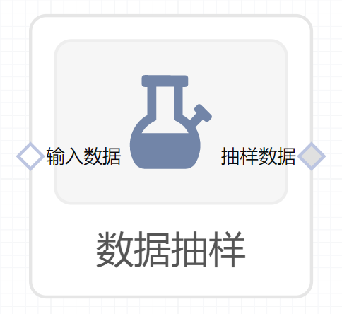

# 数据抽样使用文档
| 组件名称 |数据抽样|  |  |
| --- | --- | --- | --- |
| 工具集 | 机器学习 |  |  |
| 组件作者 | 雪浪云-墨文 |  |  |
| 文档版本 | 1.0 |  |  |
| 功能 |数据抽样 |  |  |
| 镜像名称 | ml_components:3 |  |  |
| 开发语言 | Python |  |  |

## 组件原理
对数据进行抽样分析
## 输入桩
支持单个csv文件输入。
### 输入端子1

- **端口名称：** 输入数据
- **输出类型：** Csv文件
- **功能描述：** 输入需要抽样分析的文件

## 输出桩
支持Csv文件输出。
### 输出端子1

- **端口名称：** 抽样数据
- **输出类型：** Csv文件
- **功能描述：** 处理后的文件

## 参数配置
### 抽样策略

- **功能描述：** 抽样策略
- **必选参数：** 是
- **默认值：** ratio
### 抽样比例

- **功能描述：** 抽样比例
- **必选参数：** 是
- **默认值：** （无）
### 抽样个数

- **功能描述：** 抽样个数
- **必选参数：** 是
- **默认值：** （无）
### 是否放回

- **功能描述：** 是否将抽样过的数据放回
- **必选参数：** 是
- **默认值：** false
### 随机数

- **功能描述：** 抽样的随机数
- **必选参数：** 是
- **默认值：** （无）

## 使用方法
- 加组件拖入到项目中
- 与前一个组件输出的端口连接（必须是csv类型）
- 点击运行该节点

